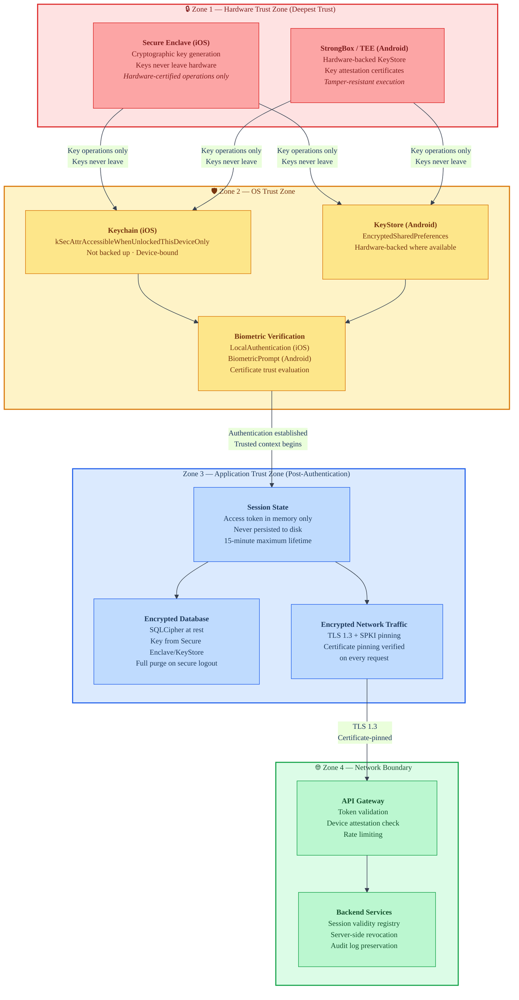
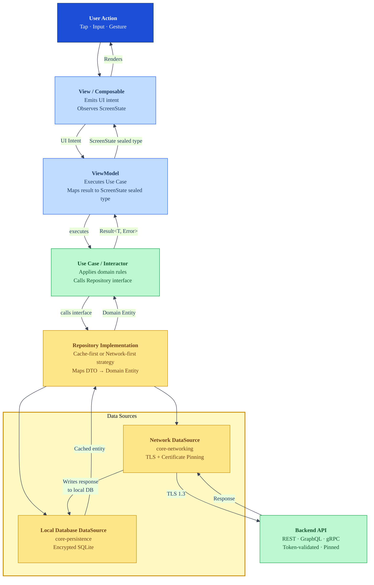

# Enterprise Mobile Architecture — Banking Applications

> **ADR Reference:** `ADR-ENT-MOB-001`
> **Alignment:** TOGAF | OWASP MASVS 2.0 | Clean Architecture | BSP Circular 982 | PCI-DSS v4.0 | ISO 27001
> **Audience:** Enterprise Architects · Engineering Leadership · Mobile Architects · Security Teams · Compliance · Delivery Managers

The authoritative architecture decision record for banking and financial services mobile applications. Defines engineering principles, security architecture, offline strategy, API design, CI/CD, testing, observability, and organisational scaling across the full mobile engineering lifecycle — from a founding team of five to a hyper-scale platform serving fifty million users.

## ADR Metadata

| Field | Value |
|---|---|
| ADR Reference | ADR-ENT-MOB-001 |
| Version | 1.0 |
| Classification | Architecture Decision Record — Enterprise Reference |
| Lifecycle Status | Active |
| Date Raised | May 2025 |
| Review Date | May 2026 |
| Author | Architecture Council — Ascendion |
| Status | ACCEPTED |
| Domain | Enterprise Mobile Architecture — Banking |
| ARB Approval | Required |
| Scope | iOS and Android Mobile Front End · Backend integration points where relevant to mobile contract obligations |

## Executive Summary

The Enterprise Mobile Banking ADR mandates a security-first, reliability-driven mobile architecture for all banking and financial services mobile applications. Clean Architecture with MVVM governs internal structure. OAuth 2.0 + PKCE governs all authentication. OWASP MASVS Level 2 is the mandatory security compliance target. Offline-capable, observable, and deterministic state management is required across all critical user journeys. The architecture treats security over convenience, reliability over velocity, and explicit dependencies over implicit coupling as non-negotiable engineering principles.

## 1. Engineering Principles

Engineering principles are not aspirational statements. They are decision-forcing constraints that resolve ambiguity when architectural choices conflict. Every principle below is actionable, testable, and directly traceable to architectural decisions throughout this document.

### 1.1 Security Over Convenience

**Statement:** When security requirements and user convenience conflict, security wins unconditionally.

**Architectural Expression:** This principle governs authentication session lifetimes, biometric re-authentication gates before high-value transactions, certificate pinning enforcement, and the prohibition of sensitive data in application caches. It drives the decision to require step-up authentication for fund transfers exceeding risk thresholds even when users are already authenticated. It prohibits storing plaintext PII in local databases, logs, or crash reports regardless of developer convenience arguments.

**Governance Implication:** Feature requests that require relaxing security controls require a documented Security Architecture Exception, signed by the CISO, with a defined remediation timeline.

### 1.2 Reliability Over Feature Velocity

**Statement:** A degraded but stable application is always preferable to a fast-moving but unstable one.

**Architectural Expression:** This principle justifies feature flag infrastructure, canary rollouts, error budget enforcement, and production kill switches. New features ship behind flags disabled by default. Crash-free session targets gate release approvals. The architecture tolerates deliberate capability reduction (graceful degradation) rather than undefined behavior under partial failures.

**Governance Implication:** Engineering teams cannot merge features that reduce measured reliability below SLO thresholds without explicit delivery manager approval and a documented mitigation plan.

### 1.3 Explicit Dependencies Over Implicit Coupling

**Statement:** All module dependencies must be declared, visible, and enforced at compile time wherever possible.

**Architectural Expression:** This drives the feature-module architecture, the use of dependency injection containers, the prohibition of service locators and ambient contexts, and the enforced dependency direction rules (see Section 5). It prevents the formation of implicit runtime coupling that cannot be detected by static analysis.

### 1.4 Backward Compatibility by Default

**Statement:** Any change to a public API, module contract, or shared schema must preserve backward compatibility unless a formal deprecation process has been completed.

**Architectural Expression:** This governs API versioning strategy, module public interface evolution, local database schema migrations, and push notification payload contracts. It protects users on older app versions during phased rollouts. Breaking changes require a minimum 90-day deprecation window with parallel support.

### 1.5 Observable Systems Over Opaque Systems

**Statement:** Any behavior that cannot be observed in production cannot be trusted, debugged, or governed.

**Architectural Expression:** All critical flows emit structured telemetry. Authentication events, transaction state transitions, network failures, and session lifecycle events are instrumented. Unobservable states are treated as architectural defects. This principle drives the distributed tracing strategy, crash analytics integration, and the observability-first approach to background synchronization.

### 1.6 Fail-Safe Degradation Over Catastrophic Failure

**Statement:** Under adverse conditions — network unavailability, backend errors, corrupted state — the application must degrade gracefully to a safe, communicative state rather than crash or exhibit undefined behavior.

**Architectural Expression:** This drives offline mode classification (Section 9), error boundary design, session timeout UX, and network circuit breaker patterns. The application must always be able to tell users what it cannot do and why, and must never silently fail in ways that affect financial data integrity.

### 1.7 Platform Consistency Over Team-Level Customization

**Statement:** Architectural patterns, module structures, coding conventions, and security controls must be consistent across all feature teams and cannot be independently overridden.

**Architectural Expression:** This justifies the Platform Engineering team model (Section 13), golden path tooling, enforced linting and static analysis rules, and architecture governance reviews. Teams optimize within established patterns; they do not create new ones without governance approval.

### 1.8 Minimize Hidden Runtime Behavior

**Statement:** The application's behavior at runtime must be derivable from its source code without requiring runtime observation to understand.

**Architectural Expression:** This prohibits reflection-heavy dependency injection frameworks, dynamic feature loading without explicit initialization contracts, and ambient global state. It favors compile-time resolution of dependencies and static routing declarations over runtime discovery patterns.

### 1.9 Prefer Compile-Time Safety

**Statement:** Errors detected at compile time are categorically superior to errors detected at runtime, especially in financial workflows.

**Architectural Expression:** This drives the choice of Swift and Kotlin over dynamically-typed alternatives, the use of sealed types for state representation, the prohibition of force-unwrapping and unchecked casts in production code, and the requirement for exhaustive pattern matching on domain enumerations.

### 1.10 Defensive Programming for Financial Workflows

**Statement:** All code handling financial transactions must assume inputs are malformed, network conditions are adversarial, and concurrent operations are possible.

**Architectural Expression:** All transaction submission flows implement idempotency keys. All monetary values use fixed-precision decimal types, never floating-point. All user-facing financial calculations are validated against backend authoritative values before display. Error paths for transaction flows are as thoroughly tested as success paths.

### 1.11 Deterministic State Management

**Statement:** Given the same sequence of events, the application must always reach the same state.

**Architectural Expression:** This drives unidirectional data flow (UDF) architecture, the prohibition of shared mutable state across threads, and the requirement for all state reducers/view models to be pure functions or produce deterministic side effects. It makes the application reproducible for debugging, testing, and compliance audit purposes.

### 1.12 Least-Privilege Security Design

**Statement:** Every component, module, and external integration receives only the permissions and data access required for its specific function.

**Architectural Expression:** Feature modules cannot access other modules' internal state directly. The networking layer cannot write to the local database. Analytic SDKs receive anonymized event identifiers, not raw PII. This principle governs module API surface design, dependency injection scoping, and third-party SDK data isolation.

---

## 2. Non-Functional Requirements

NFRs are contractual obligations of the architecture, not aspirational targets. All SLOs defined here must be measurable in production, included in operational dashboards, and enforced as release gates.

### 2.1 Availability and Reliability

| NFR | Target | Measurement Method | Release Gate |
| --- | --- | --- | --- |
| Crash-free session rate | ≥ 99.9% | Crash analytics platform (e.g., Firebase Crashlytics, Instabug) | Yes — blocks release if breached |
| ANR-free session rate (Android) | ≥ 99.95% | Google Play Android Vitals | Yes |
| App startup failure rate | ≤ 0.01% | Custom startup telemetry | Yes |
| Session availability (network-connected) | ≥ 99.5% | Transaction completion telemetry | Yes |
| Offline mode availability (cached flows) | 100% of classified offline-capable flows | Functional test suite | Yes |

### 2.2 Performance

| NFR | Target | Measurement Method |
| --- | --- | --- |
| Cold launch time (time-to-interactive) | ≤ 2.0s on median device (P50) | Custom launch telemetry |
| Cold launch time (P95 device) | ≤ 3.5s | Custom launch telemetry |
| Warm launch time (P50) | ≤ 0.8s | Custom launch telemetry |
| Screen load time (P50, network-connected) | ≤ 1.5s | Screen timing telemetry |
| Transaction submission latency (P95) | ≤ 3.0s end-to-end | Transaction telemetry |
| Animation frame rate | ≥ 60fps; 120fps on ProMotion/high-refresh hardware | Rendering telemetry |
| UI thread blocking (iOS main thread, Android main thread) | Zero blocking operations > 16ms | Profiling CI gates |

### 2.3 Scalability

| NFR | Target |
| --- | --- |
| Concurrent active users (architecture must support) | 10 million+ |
| Feature teams deployable in parallel | Unlimited (module isolation) |
| Module build time (incremental, clean module) | ≤ 60 seconds |
| Full clean build time | ≤ 20 minutes (CI) |
| App binary size (iOS IPA, Android APB) | ≤ 80MB download size |

### 2.4 Security SLAs

| NFR | Target | Enforcement |
| --- | --- | --- |
| Critical security vulnerability remediation | 24 hours from confirmed exploit | SSDLC gate |
| High severity vulnerability remediation | 7 days | SSDLC gate |
| Medium severity vulnerability remediation | 30 days | SSDLC gate |
| Certificate pinning failure response | Immediate session termination | Architectural enforcement |
| Jailbreak/root detection response time | < 500ms from app launch | Architectural enforcement |

### 2.5 Disaster Recovery

| NFR | Target |
| --- | --- |
| Recovery Time Objective (RTO) — app rollback to previous version | ≤ 4 hours (staged rollout reversal) |
| Recovery Time Objective (RTO) — feature kill switch activation | ≤ 15 minutes (remote config propagation) |
| Recovery Point Objective (RPO) — local transaction data | Zero loss for queued offline transactions |
| App Store rollback feasibility | All releases must support same-day phased rollout reversal |

### 2.6 Accessibility

| NFR | Target | Standard |
| --- | --- | --- |
| WCAG compliance level | AA minimum; AAA for core banking flows | WCAG 2.1 |
| Dynamic Type support range | iOS: all content size categories including accessibility sizes | iOS HIG |
| Screen reader compatibility | 100% of transactional flows | VoiceOver (iOS), TalkBack (Android) |
| Accessibility audit cadence | Every major release | Internal + external audit |
| Minimum tap target size | 44×44pt (iOS), 48×48dp (Android) | Platform HIG |

### 2.7 Observability Requirements

| NFR | Target |
| --- | --- |
| Crash symbolication time | ≤ 30 minutes from crash report receipt |
| Production incident detection time | ≤ 5 minutes from anomaly onset |
| Distributed trace coverage (critical flows) | 100% of authentication, transaction, and onboarding flows |
| Log retention period | Minimum 90 days (compliance-dependent, up to 7 years for audit logs) |

### 2.8 Release Governance

| NFR | Target |
| --- | --- |
| Canary rollout initial cohort | 1% of users |
| Canary promotion gates | Crash rate, ANR rate, transaction success rate, session duration |
| Maximum phased rollout duration | 7 days (full rollout) |
| Feature flag propagation latency | ≤ 60 seconds to 99% of devices |

### 2.9 Battery and Resource Consumption

| NFR | Target |
| --- | --- |
| Background battery consumption | No measurable drain above system baseline when app is backgrounded with no active sync |
| Background network usage | Restricted to explicit sync windows; never continuous polling |
| Memory usage (P50, connected home screen) | ≤ 150MB RSS |
| Memory usage (P95, peak transaction flow) | ≤ 300MB RSS |

---

## 3. Core Architecture Goals

The eight pillars below are ordered by architectural priority. When two pillars conflict, the higher-numbered pillar defers to the lower unless a documented exception exists.

**Pillar 1 — Security and Compliance Readiness.** The architecture must ensure banking-grade security by default, not as an addition. Security controls are structural, not decorative. Compliance evidence must be collectable without requiring application changes.

**Pillar 2 — Reliability and Operational Stability.** The application must remain stable under adverse conditions. Reliability engineering is a first-class architectural concern, not an operational afterthought.

**Pillar 3 — Scalability and Modular Extensibility.** The architecture must support 10+ million users, dozens of feature teams, and 5–10 years of feature expansion without requiring foundational restructuring. Modularity is the primary enabler of this.

**Pillar 4 — Performance.** Banking applications compete with the responsiveness expectations set by native platform applications. Performance is an architectural requirement, not a later optimization.

**Pillar 5 — Developer Productivity and Maintainability.** Architecture complexity must not grow faster than organizational capability to manage it. Onboarding a new engineer to a feature module must be achievable within one working day.

**Pillar 6 — Observability and Operational Excellence.** The production system must be understandable, debuggable, and governable by operational teams without requiring engineering intervention for routine monitoring.

**Pillar 7 — Release Safety and Continuous Delivery.** The architecture must support continuous, safe delivery with rollback capability. Releases are not events; they are ongoing operational processes.

**Pillar 8 — Banking-Grade User Experience.** The application must provide a trustworthy, consistent, and accessible experience. UX quality is a compliance and brand obligation, not only a design preference.

---

## 4. Technology Decisions

### ADR-001: Native iOS (Swift + SwiftUI) and Native Android (Kotlin + Jetpack Compose)

#### Context

A banking application serving tens of millions of users across multiple regulatory environments must make a definitive, long-term technology choice for its mobile front end. This decision will affect security posture, performance, developer ecosystem, compliance capability, and total cost of ownership across a 5–10 year horizon. The decision cannot be easily reversed once significant engineering investment has been made.

#### Problem Statement

Which mobile development technology provides the optimal combination of security, performance, reliability, maintainability, and compliance capability for a mission-critical, enterprise banking application?

#### Constraints

The technology choice must support: (1) access to platform-level security hardware (Secure Enclave, Android Keystore), (2) certification-grade accessibility compliance, (3) deterministic performance under load, (4) long-term platform support guarantees, (5) independent platform release cadences, (6) compliance with banking-specific operating environment requirements including jailbreak/root detection APIs.

#### Decision

**Native development is mandated.** iOS using Swift with SwiftUI for UI layers. Android using Kotlin with Jetpack Compose for UI layers. Business logic, domain models, and data layers remain platform-specific implementations with equivalent architecture.

#### Alternatives Considered

**Flutter (Dart/Skia rendering engine)**

Flutter renders via its own Skia/Impeller engine rather than native platform components. This introduces a fundamental divergence from platform security and accessibility models. The Flutter engine is an additional runtime layer that increases attack surface, complicates root/jailbreak detection, and cannot natively access all platform security APIs without custom channel implementation. Flutter's accessibility support is improving but remains structurally distinct from VoiceOver and TalkBack integration, creating compliance risk in regulated environments. The framework's rapid evolution (multiple breaking changes per year) creates maintenance overhead incompatible with the stability requirements of banking applications. For an enterprise banking context, Flutter is **not recommended for primary application development** but may be considered for limited, non-security-critical internal tools.

**React Native (JavaScript bridge / JSI)**

React Native's fundamental architectural limitation for banking is the JavaScript bridge or JSI layer that mediates between JavaScript application code and native platform APIs. This indirection introduces latency, complicates secure coding practices, creates a larger attack surface for reverse engineering, and limits access to low-level platform security APIs. Memory management is non-deterministic from the application layer's perspective. The Metro bundler and JavaScript runtime add startup time overhead that conflicts with the cold-launch NFR. Enterprise banking security teams consistently identify JavaScript-based runtimes as elevated risk due to the relative ease of code injection and tampering. React Native is **not recommended for banking applications** outside narrow use cases such as simple informational screens with no financial data handling.

**Kotlin Multiplatform (KMP)**

KMP occupies a different architectural position: it enables sharing of business logic, domain models, data access layers, and utilities between iOS and Android while leaving UI implementation to native platform frameworks. Unlike Flutter and React Native, KMP does not introduce a cross-platform UI rendering engine or a non-native runtime. KMP is architecturally compatible with the native approach and is assessed as a **conditionally recommended evolution path** for shared non-UI layers once the native architecture is mature and stable. The primary risk is the current immaturity of KMP tooling for complex iOS interoperability scenarios. KMP adoption is deferred to the Mid-Scale evolution tier (Section 12) with a formal evaluation gate.

#### Decision Matrix

| Criterion | Weight | Native iOS/Android | Flutter | React Native | KMP (Shared Logic Only) |
| --- | --- | --- | --- | --- | --- |
| Platform security API access | 15% | 10 | 6 | 5 | 10 |
| Secure Enclave / Keystore integration | 12% | 10 | 5 | 5 | 10 |
| Runtime performance (startup, rendering) | 10% | 10 | 7 | 5 | 9 |
| Compliance readiness (PCI, accessibility) | 10% | 10 | 6 | 5 | 10 |
| Long-term platform support guarantees | 8% | 10 | 6 | 5 | 8 |
| Root/jailbreak detection fidelity | 8% | 10 | 5 | 4 | 10 |
| Accessibility (VoiceOver/TalkBack) | 7% | 10 | 6 | 6 | 10 |
| Offline reliability | 7% | 10 | 7 | 6 | 9 |
| Independent platform release cadence | 6% | 10 | 5 | 5 | 10 |
| Team scaling and hiring | 5% | 9 | 7 | 7 | 8 |
| Long-term TCO (5-year horizon) | 5% | 8 | 7 | 6 | 9 |
| Build system complexity | 4% | 8 | 6 | 5 | 7 |
| Debug and profiling tooling | 3% | 10 | 6 | 5 | 9 |
| **Weighted Score** | **100%** | **9.78** | **6.14** | **5.22** | **9.40** |

#### Tradeoffs

Choosing native development accepts: (1) duplicate implementations of equivalent functionality on each platform, (2) higher initial staffing cost requiring platform-specialist engineers rather than generalists, (3) longer time-to-market for features that must ship simultaneously on both platforms, (4) no code sharing between platforms in the base architecture.

These tradeoffs are accepted because the security, performance, and compliance benefits of native development are non-negotiable in a banking context. The cost of a security incident, a compliance failure, or a regulatory finding far exceeds the cost of platform duplication over any reasonable time horizon.

#### Risks

**Risk:** Native talent scarcity, particularly iOS Swift engineers, may create delivery bottlenecks.  

**Mitigation:** Invest in internal training pipelines. Establish clear golden path standards that make onboarding faster. Consider KMP for shared logic layers at Mid-Scale to reduce the surface area requiring platform specialists.

**Risk:** Platform divergence may cause behavioral differences between iOS and Android that affect compliance.  

**Mitigation:** Shared behavioral test suites (contract tests) enforce equivalent behavior across platforms. Security architecture reviews cover both platforms simultaneously.

#### Security Implications

Native development provides direct, auditable access to platform-certified security APIs: iOS Secure Enclave for key storage, iOS CryptoKit for cryptographic operations, Android Keystore with hardware-backed key attestation, and Android Biometric APIs with hardware-level authentication guarantees. These cannot be replicated with equivalent security guarantees through abstraction layers.

#### Long-Term Maintainability

Swift and Kotlin are first-party languages with Apple and Google roadmap commitments spanning the foreseeable future. SwiftUI and Jetpack Compose are the strategic UI frameworks of their respective platforms. The risk of framework abandonment is categorically lower than for third-party cross-platform frameworks.

#### Organizational Implications

Staffing must include dedicated iOS and Android engineering capability. Platform teams and feature teams both require platform-specialist engineers. Architecture governance must cover both platforms. This adds organizational overhead that is explicitly accepted as a cost of the security and reliability posture required for banking.

---

## 5. Architecture Style and Layering

### ADR-002: Modular Clean Architecture with MVVM, Unidirectional Data Flow, and Feature-Based Modularization

#### Context

A banking application developed by multiple parallel teams across a 5–10 year lifecycle requires an architectural style that enforces separation of concerns, prevents circular dependencies, supports independent testing and build, and resists gradual degradation under continuous feature addition.

#### Decision

**Modular Clean Architecture** is the mandated architectural style. The application is decomposed into independently buildable feature modules and shared infrastructure modules. Within each module, layers follow Clean Architecture principles: Presentation, Domain, and Data. State management follows Unidirectional Data Flow. Navigation is coordinator-driven.

#### Layering Model

**Presentation Layer** contains all UI code (SwiftUI Views, Jetpack Compose composables), ViewModels/Presenters, and UI state models. This layer has no knowledge of the Domain layer's implementation details; it communicates only through Use Case/Interactor interfaces. The Presentation layer is platform-specific and cannot be shared.

**Domain Layer** contains business logic, entity models, use case/interactor interfaces and implementations, repository interfaces, and domain events. The Domain layer has zero dependencies on platform APIs, networking libraries, or persistence frameworks. It is pure business logic expressed in platform language constructs. This layer is the most stable and most testable layer in the system.

**Data Layer** contains repository implementations, network data sources, local persistence data sources, mappers between data transfer objects and domain entities, and caching strategy implementations. The Data layer depends on the Domain layer (implements its interfaces) but the Domain layer has no knowledge of the Data layer.

#### Dependency Direction Rules

**Mandatory rule:** Dependencies flow inward only. Presentation → Domain ← Data. The Domain layer must never import the Presentation or Data layers. The Data layer must never import the Presentation layer. Circular dependencies between any layers or modules are architectural violations.

**Module-level dependency rule:** Feature modules may depend on Core modules and Domain modules. Feature modules must never depend on other Feature modules directly. Cross-feature communication occurs through shared domain event buses or coordinator-mediated navigation. Core modules must never depend on Feature modules.

#### Design Patterns

**MVVM (Model-View-ViewModel):** The ViewModel is the boundary between Presentation and Domain. It holds UI state, exposes state as observable streams, and delegates business operations to Use Cases. ViewModels have no direct knowledge of UI framework lifecycle in their business logic — they are lifecycle-aware at the Presentation layer binding only.

**Repository Pattern:** All data access is mediated through Repository interfaces defined in the Domain layer. Concrete implementations in the Data layer can switch between network, cache, and local storage without the Domain layer changing. Repository interfaces return domain entities, never raw network models.

**Use Case / Interactor Pattern:** Each discrete business operation is encapsulated as a Use Case class with a single execute method. Use Cases are the unit of business logic reuse. They compose Repository operations, apply domain rules, and return domain results. A Transfer funds operation is a Use Case. A Validate IBAN operation is a Use Case.

**Coordinator / Router Pattern:** Navigation is extracted from ViewModels and Views. Coordinators own navigation stacks and handle flow between screens. Deep link handling, session timeout navigation, and authentication-gated flows are implemented in Coordinators. This prevents ViewModels from becoming coupled to navigation destinations.

**Dependency Injection:** Constructor injection is the mandated approach. Service locators and static accessors are prohibited. DI container scope aligns with module lifecycle: application-scoped dependencies are application-scoped in the container; screen-scoped dependencies are disposed with the screen lifecycle.

#### Module Ownership

Each module has a declared owning team. Module boundaries are enforced by build system configuration: feature modules cannot access each other's internal implementations, only their declared public APIs. Public APIs are minimal by default — the least surface area required for integration.

#### State Management

See Section 6 for detailed state management guidance. The architectural requirement here is that all mutable state lives in ViewModels or dedicated state stores, never in Views or composables directly for domain state, and never in singletons accessible globally.

#### Tradeoffs

This architecture introduces boilerplate. A simple read-and-display screen requires entities in Domain, a repository interface in Domain, a repository implementation in Data, a Use Case in Domain, a ViewModel in Presentation, and a View. For early-stage features this feels heavyweight. The tradeoff is explicitly accepted: the architecture's discipline prevents the accumulation of spaghetti patterns that have destroyed maintainability in banking applications that started with simpler approaches and grew beyond their architecture's capacity.

---

## 6. Mobile State Management

### ADR-003: Hierarchical State Ownership with Unidirectional Data Flow

#### Context

Banking applications manage multiple concurrent state domains: UI rendering state, authentication state, session state, offline transaction queues, background synchronization, and domain data. Improper state ownership and synchronization is the most common source of production defects in mobile banking applications, ranging from duplicate transaction submissions to authentication bypass edge cases.

#### Decision

State is organized into a strict ownership hierarchy with well-defined synchronization rules. Unidirectional Data Flow is enforced at every layer. No state escapes its owning scope.

#### State Domain Classification

**UI State** is owned exclusively by the ViewModel or Composable/View owning the screen. It represents transient rendering concerns: loading indicators, form validation messages, animation triggers. UI state is not persisted and is not shared across screens. It is recreated on screen navigation.

**Screen State** is the composite state exposed by a ViewModel to its View. It is a sealed type or data class representing all possible states of a screen: Loading, Content(data), Error(message), Empty. Screen state is derived — it is computed from domain state changes, never independently mutated.

**Domain State** is owned by the Domain layer and coordinated by Use Cases and Repositories. It represents authoritative application data: account balances, transaction history, payment beneficiaries. Domain state is the source of truth for all screen states.

**Session State** is owned by a dedicated AuthenticationStateManager/SessionCoordinator. It represents the user's authentication context: authenticated, unauthenticated, token expiring, locked. Session state changes trigger application-wide reactions: routing to login, clearing cached data, pausing background sync. Session state is application-scoped and observable by all features that require authentication context.

**Authentication State** is a sub-domain of session state representing the credential and token lifecycle: valid, refreshing, expired, revoked. Authentication state management includes token refresh orchestration with backoff and retry semantics.

**Global Application State** is minimized by design. Only session state, feature flag values, and remote configuration are legitimately global. All other state is scoped to the feature or screen that owns it. Global state is a code smell in this architecture and requires architectural review to justify.

**Background Synchronization State** tracks the status of pending sync operations, last sync timestamp, and pending conflict resolution items. It is owned by a dedicated SyncCoordinator that operates independently of UI lifecycle.

**Offline Transaction State** represents transactions queued for submission while offline. This state is persisted to encrypted local storage, survives app restarts, and is managed by a dedicated OfflineTransactionQueue component. Offline transaction state is the highest-criticality state in the system from a data integrity perspective.

#### Platform-Specific Implementation

**iOS (SwiftUI):**

ViewModels are `ObservableObject` classes or actor-isolated observable models conforming to the `Observable` macro pattern (Swift 5.9+). State properties are marked `@Published` or use the `@Observable` macro. Views observe ViewModels through `@StateObject` (ownership) or `@ObservedObject` (injection). Global session state uses `@EnvironmentObject` sparingly and only for well-defined, stable contexts.

Application-scoped state uses `actor`-isolated singletons to enforce thread safety at compile time. All state mutation is performed on the main actor for UI-affecting state. Background operations return results to the main actor explicitly.

Combine or Swift Concurrency (async/await with AsyncStream) is used for reactive state propagation. Combine is preferred for complex multi-stream transformations; Swift Concurrency is preferred for simpler sequential async flows. Mixing both is acceptable with clear boundaries.

**Android (Jetpack Compose):**

ViewModels use `StateFlow` or `MutableStateFlow` for state exposure. UI state is represented as a single sealed class or data class collected via `collectAsStateWithLifecycle()` in composables. Compose `remember` and `rememberSaveable` are used for ephemeral UI state; they are never used for domain state.

`viewModelScope` is the lifecycle boundary for ViewModel coroutines. Application-scoped operations use a dedicated `applicationScope` injected via DI. All UI state updates occur on `Dispatchers.Main`. Heavy operations are explicitly dispatched to `Dispatchers.IO` or `Dispatchers.Default`.

`hiltViewModel()` provides ViewModel injection within Compose. `CompositionLocalProvider` is the equivalent of iOS `@EnvironmentObject` and is used with the same discipline: sparingly, for stable, well-defined contexts only.

#### Anti-Patterns (Prohibited)

**Shared mutable global state:** Global variables or static mutable properties holding domain state. Risk: race conditions, untestable behavior, audit impossibility.

**State in Views/Composables for domain data:** Storing account balances or transaction data directly in `@State` (iOS) or `remember` (Android). Risk: state lost on recomposition, not survives lifecycle events, cannot be tested independently.

**ViewModel-to-ViewModel direct calls:** ViewModels directly calling methods on other ViewModels. Risk: implicit coupling, initialization order dependencies, testability collapse.

**Synchronous state mutations from background threads:** Mutating `@Published` properties or `StateFlow` from non-main threads without explicit dispatcher context. Risk: undefined rendering behavior, potential crashes in Compose.

**Offline transaction state in memory only:** Holding queued transactions in memory without persistence. Risk: data loss on process termination, which is a critical financial data integrity failure.

#### State Synchronization Strategy

Background sync operations update local database state. Repositories observe database state changes and emit updates. ViewModels collect repository emissions. Views re-render. This pull-through synchronization ensures UI always reflects persisted state rather than in-memory network responses. The invariant is: the local database is the single source of truth; network responses update the database; the database notifies observers.

#### Memory Management Implications

ViewModels must not hold strong references to View objects, Context objects (Android), or UIViewController objects (iOS). ViewModels are scoped to screen lifecycle and must be eligible for garbage collection when the screen is destroyed. Retain cycle analysis is part of the CI pipeline (iOS Instruments integration, Android LeakCanary integration).

---

## 7. Security and Compliance Architecture

### ADR-004: Defense-in-Depth Mobile Security Architecture

#### Context

Banking applications are the highest-value targets for mobile security attacks. Account takeover, transaction fraud, credential theft, and session hijacking represent direct financial loss and regulatory liability. The mobile client is an untrusted environment: it operates on devices outside organizational control, potentially compromised by malware, jailbreaking, or social engineering. The architecture must provide meaningful security guarantees in this adversarial environment.

#### Decision

A defense-in-depth security architecture is mandated. No single security control is sufficient; the architecture assumes any individual control may be circumvented and requires multiple independent controls to be bypassed for an attack to succeed.

#### 7.1 Authentication and Authorization

**OAuth 2.0 with PKCE and OIDC** is the mandated authentication protocol. Authorization code flow with PKCE is required for all authentication. Implicit flow is prohibited. Client credentials are never embedded in the mobile application binary.

**Token Architecture:** Access tokens have a maximum lifetime of 15 minutes. Refresh tokens have a maximum lifetime of 8 hours for standard sessions and 30 days for explicitly consented persistent sessions. Refresh tokens are stored in platform-secure storage only (iOS Keychain, Android Keystore-protected SharedPreferences or EncryptedSharedPreferences). Access tokens are held in memory only and never persisted to disk.

**Multi-Factor Authentication (MFA):** All authentication flows require MFA. Supported factors: biometric (primary, hardware-backed), TOTP (backup), SMS OTP (allowed for onboarding, discouraged for ongoing authentication due to SIM-swap risk), push notification approval. MFA factor selection follows a risk-based policy: transaction value, unusual location, new device, and account age all influence factor requirements.

**Biometric Authentication:** Biometric authentication uses platform-native APIs with hardware-backed verification. iOS uses LocalAuthentication with `.biometricCurrentSet` policy to invalidate biometric enrollment on changes. Android uses BiometricPrompt with `CryptoObject` backed by hardware-secured KeyStore keys bound to biometric enrollment. Biometric authentication is never used as a standalone authentication factor for high-value transactions; it is a convenience layer over a valid server-issued session.

**Session Lifecycle:** Sessions have configurable inactivity timeouts (default: 5 minutes for foreground inactivity, 30 seconds for background). Session timeout triggers secure logout including clearing access tokens from memory, clearing sensitive data from UI, and navigating to the authentication screen. Sessions are server-side revocable; the backend maintains a session validity registry.

**Step-Up Authentication:** Operations exceeding defined risk thresholds (configurable: default > $500 or equivalent, new beneficiary addition, international transfer, account settings change) require step-up authentication. Step-up authentication re-challenges the user's second factor regardless of current session state. Step-up tokens have a maximum lifetime of 60 seconds and are single-use.

**Secure Logout:** Logout is not merely a UI navigation. Secure logout: revokes the refresh token server-side, clears access token from memory, clears all cached user data from memory, triggers local database encrypted data wipe, removes keychain/keystore session entries, and navigates to unauthenticated state. Incomplete logout is a security defect.

#### 7.2 Device Security

**Jailbreak and Root Detection:** Detection is a layered approach; no single detection method is reliable against sophisticated bypass attempts. The approach combines: file system checks for known jailbreak artifacts, dylib injection detection (iOS), su binary detection (Android), system call behavior analysis, and third-party device integrity attestation (see App Attestation below). Detection results are submitted to the fraud detection backend, not used exclusively to deny access — binary denial creates exploitable bypass patterns. High-risk operations are blocked on detected compromised devices; standard browsing is permitted with risk flagging.

**Emulator Detection:** The application detects and reports emulator execution. Certain high-value operations (initial device registration, high-value transactions) are blocked in emulator environments. Detection methods include hardware identifier analysis, sensor availability checks, and build property inspection.

**Runtime Tampering Detection:** The application performs periodic integrity checks against a registered hash of its own executable code segments. iOS jailbreak frameworks and Android frida/xposed framework presence is detected through known artifact inspection. Tampering detection is asynchronous and non-blocking; positive detection triggers risk escalation to the backend fraud system.

**Device Integrity Validation — App Attestation:** iOS DeviceCheck and App Attest APIs are integrated. Android Play Integrity API is integrated. Attestation tokens are submitted to the backend with authentication and high-value transaction requests. The backend validates attestation server-side. Client-side attestation results are advisory only — authoritative validation is server-side.

**Secure Enclave / Keystore Usage:** Cryptographic keys used for authentication, session protection, and local data encryption are generated inside and never extracted from platform secure hardware. iOS: SecKey operations with `kSecAttrTokenIDSecureEnclave`. Android: KeyStore with `setIsStrongBoxBacked(true)` where hardware-backed StrongBox is available, falling back to TEE-backed keys.

#### 7.3 Data Security

**Encryption at Rest:** All locally persisted sensitive data is encrypted. The encryption key is derived from a hardware-backed key combined with a user-derived factor (biometric authentication unlocks the key derivation). iOS: SQLCipher or Swift Data with file-level encryption using Data Protection `.completeUnlessOpen` class minimum, `.complete` for highest-sensitivity data. Android: EncryptedSharedPreferences for key-value data, SQLCipher for relational data, encrypted file provider for binary data.

**Encryption in Transit:** TLS 1.2 minimum, TLS 1.3 preferred for all network communication. Cipher suites restricted to forward-secrecy-providing suites. No plaintext HTTP permitted under any circumstances including internal API endpoints.

**Certificate Pinning:** Certificate pinning is implemented for all API domains using hash-pinned leaf certificates with backup pins. iOS: URLSession certificate pinning via custom URLSessionDelegate with `SecTrust` validation. Android: OkHttp `CertificatePinner` with domain-specific pin sets. Pinning failures result in immediate network request termination and security event reporting to the backend. Pin rotation is managed through a coordinated release process with backup pins always deployed before rotation of primary pins.

**Secure Local Storage:** Third-party local storage solutions that do not use platform-native encryption are prohibited. All local database access goes through the encrypted persistence layer. Cache storage (URL cache, image cache) is disabled for responses containing financial data. HTTP response caching headers for financial APIs must enforce `no-store`.

**PII Handling:** PII is stored locally only when operationally required (e.g., display name for personalization). PII is never stored in crash reports, analytics events, or log files. PII in transit is minimized through request parameter scrubbing. The application does not store full account numbers, full card numbers, or authentication credentials locally.

**Sensitive Data Masking:** Financial amounts, account numbers, and card numbers are masked in the UI by default with user-initiated reveal gestures. Masking is persistent: navigating away and returning resets to masked state.

**Clipboard Protection:** The application clears clipboard contents when moving to background if clipboard data was set by the application. Sensitive fields (password inputs, OTP inputs, card number inputs) disable clipboard read access where platform APIs permit. Android: `setCustomSelectionActionModeCallback` to suppress copy on sensitive fields. iOS: `UITextField.isSecureTextEntry` for password fields; custom clipboard clearing for other sensitive fields.

**Screenshot Prevention:** iOS: Secure text entry fields use system-level screenshot obscuring. A custom window overlay is applied during authentication flows to prevent screenshot capture of credentials. Android: `FLAG_SECURE` is applied to all Activities and Fragments containing financial data. Implementation note: `FLAG_SECURE` also prevents Google Assistant screen understanding — this is an accepted tradeoff for financial data protection.

#### 7.4 Operational Security

**Fraud Detection Hooks:** The mobile application is a data collection node for the fraud detection system. Events submitted to the fraud platform: device fingerprint on registration, authentication attempts (success and failure), transaction initiation and completion, session anomalies (rapid location change, unusual session duration, atypical transaction patterns), device state changes (biometric enrollment change, OS update, app update). Events are anonymized at collection; correlation is performed server-side.

**Audit Logging:** Security-relevant events are logged with: event type, timestamp (UTC, millisecond precision), session identifier (not user identifier — correlation is server-side), device identifier (stable, hardware-derived, not IDFA/GAID which are privacy-sensitive), event outcome (success/failure/anomaly), and relevant context parameters. Audit logs are submitted to the backend synchronously for security-critical events; asynchronously for informational events.

**Secrets Management:** No secrets are embedded in application binaries, configuration files, Info.plist, or build artifacts. API keys required for third-party SDKs are obtained at runtime from a secrets management service after authentication. Build-time secrets (code signing certificates, provisioning profiles, API keys used during build) are managed through CI/CD secrets vaults (not version-controlled).

**Environment Isolation:** Production, staging, and development environments use completely isolated credential sets, API endpoints, and security configurations. It is architecturally impossible for a production credential to be used in a development build. Environment selection is compile-time, not runtime configurable.

#### 7.5 Compliance Considerations

**PCI DSS Mobile:** The application must comply with PCI DSS v4.0 requirements applicable to mobile applications including Requirement 6 (secure development), Requirement 8 (authentication), and Requirement 12 (security policies). The architecture supports PCI compliance through: SSDLC integration, mandatory code review, automated SAST/DAST, and audit log preservation.

**GDPR and Data Privacy:** The application implements purpose-limited data collection. User consent is obtained before any analytics collection. Data subject rights (access, deletion, portability) are supported through backend APIs. The mobile application mediates these requests but does not implement them independently. Local data deletion on account closure is implemented through the secure logout flow extended with full local data purge.

**Data Residency:** For multi-country deployments, the application respects data residency requirements by routing API requests to region-specific endpoints. Region routing is determined at login time based on the user's registered jurisdiction. The mobile client does not apply region routing logic independently; it follows backend-provided endpoint directives.

**Audit Readiness:** All security-relevant application behaviors are auditable through the backend audit log system. The mobile client is not the system of record for compliance evidence; it is a data contributor. Audit evidence collection does not require application changes; all required events are already instrumented.

---

## 8. Secure Software Development Lifecycle (SSDLC)

### ADR-005: Integrated Security Engineering Across the Development Lifecycle

#### Context

Security cannot be bolted onto a banking application after development. Vulnerabilities discovered in production banking applications carry regulatory, financial, and reputational consequences disproportionate to those in other industries. Security must be a structural property of the development process.

#### Secure Coding Standards

All production code must conform to: OWASP Mobile Security Testing Guide (MSTG) coding recommendations, platform-specific security guidelines (Apple Secure Coding Guide, Android Security Best Practices), and internal banking security coding standards (maintained by the Security Architecture team). Standards are enforced through automated linting rules integrated into the CI pipeline. Manual exceptions require written Security Architecture approval.

Specific prohibitions: force-unwrap (`!`) in Swift without documented justification; unchecked casting (`as!`) without nil-safe validation; `NSLog` or `print` in production builds containing non-anonymized data; `DispatchQueue.main.sync` (deadlock risk); `WKWebView` with unrestricted navigation policies; `UIWebView` (deprecated, prohibited); `WebView.setWebContentsDebuggingEnabled(true)` in production.

#### SAST Integration

Static Application Security Testing runs on every pull request. Tools: iOS — SwiftLint with security rules + custom analyzers for common security anti-patterns; Android — Android Lint + detekt with security rule sets. Additionally, a dedicated mobile SAST platform (e.g., Checkmarx Mobile, MobSF in CI mode) runs on every merge to the main branch. SAST findings of High or Critical severity block merge.

#### DAST Integration

Dynamic Application Security Testing runs against deployed test builds in CI. DAST scope includes: network traffic analysis (certificate pinning verification, plaintext data detection), local storage inspection (sensitive data in cleartext), API contract security testing (authentication token handling, injection attack surfaces). DAST results are reported to the Security team and integrated into the release health dashboard.

#### Dependency Scanning

All third-party dependencies are scanned on every build against known CVE databases. Tools: iOS — swift-package-manager dependency graph + vulnerability scanning integration; Android — Gradle dependency scanning + OWASP Dependency-Check. Known Critical vulnerabilities in dependencies block builds. High vulnerabilities generate alerts with a 7-day remediation SLA.

#### Secrets Scanning

The CI pipeline includes pre-commit and pre-merge secrets scanning to prevent accidental commitment of API keys, certificates, or credentials. Tools: truffleHog, gitleaks, or equivalent. Detected secrets in version history are treated as compromised and rotated immediately.

#### Threat Modeling

Threat modeling is conducted for: new features that introduce financial transaction flows, new authentication mechanisms, new third-party integrations, and changes to local data storage schemas. Threat models use STRIDE methodology. Threat model outputs are reviewed by the Security Architecture team before feature development begins. Threat models are maintained as living documents updated with feature evolution.

#### Penetration Testing

External penetration testing is conducted annually by a qualified third-party security firm. Internal security reviews are conducted for every major release. Penetration testing scope: authentication bypass, session management, data storage security, network communication security, binary protections, and platform-specific attack vectors. Findings of Critical or High severity block release.

#### Security Review Gates

Pull Request Gate: SAST clean, no new High+ security findings.  

Merge Gate: Dependency scan clean, secrets scan clean, security unit tests passing.  

Release Gate: DAST clean, penetration test findings remediated (if applicable), security architecture sign-off.

#### Vulnerability Remediation SLAs

Critical (active exploit): 24 hours. High: 7 calendar days. Medium: 30 calendar days. Low: Next planned release. Remediation SLAs are tracked in the security findings registry. Breached SLAs trigger escalation to the CISO.

#### Production Security Monitoring

Runtime application self-protection (RASP) telemetry from jailbreak/root detection, integrity checking, and fraud detection hooks flows to the SIEM. Security anomaly alerts (unusual authentication patterns, certificate pinning failures, mass session invalidation) are configured in the SIEM with defined response playbooks.

---

## 9. Offline and Reliability Strategy

### ADR-006: Hybrid Offline Architecture with Workflow Classification

#### Context

Banking applications serve users in environments with intermittent network connectivity. A strict online-only architecture degrades the user experience in subways, low-coverage areas, and during network incidents. However, a fully offline-capable architecture for financial transactions introduces unacceptable risks of fraudulent or erroneous operations on stale data. A nuanced classification of workflows governs what may operate offline.

#### Offline Architecture Style Decision

**Hybrid offline architecture** is adopted. The application implements an offline-first data access pattern for read operations and an online-mandatory pattern with queuing support for write operations. This distinction is fundamental.

Read operations (balance display, transaction history browsing, beneficiary list, product information) use a cache-first strategy with background refresh. Users always see data, which may be slightly stale, rather than an error screen. Cache staleness is communicated transparently.

Write operations (fund transfers, payments, profile changes) are never executed against locally-cached state. They require network connectivity. In offline conditions, certain low-risk write operations may be queued for execution when connectivity is restored.

#### Workflow Classification

**Class A — Fully Offline Capable (Read):** Account balance display (with staleness indicator), transaction history browsing (last 90 days cached), beneficiary list viewing, ATM and branch locator, product brochure content, help and FAQ content. These workflows operate from local cache with no network requirement.

**Class B — Offline-Readable, Online-Transactional:** Payment initiation UI navigation, transfer form pre-population (pre-filled from cached beneficiary data), bill payment schedule viewing, investment portfolio viewing. Users may navigate to these screens and pre-fill forms offline, but submission requires network connectivity. The UI communicates this requirement proactively, not as an error at submission time.

**Class C — Queueable Offline Write (Limited Scope):** Scheduled payment creation (within pre-validated limits to pre-approved beneficiaries). These operations may be queued offline with user awareness that execution is pending network restoration. Queued operations are prominently displayed in a pending operations UI. The queue mechanism is described in detail below.

**Class D — Strictly Online Only:** Real-time fund transfers, international wire transfers, card activation, account opening, authentication, step-up authentication, any operation on a new (not previously verified) beneficiary, any operation exceeding configurable risk thresholds. These operations have zero offline mode; the application presents a clear offline state message rather than a degraded attempt.

**Class E — Regulatory-Sensitive (Always Online):** AML-triggered reviews, regulatory reporting submissions, compliance consent recording, account suspension actions. These operations require not only connectivity but verified backend session state at execution time.

#### Offline Queue Architecture

The offline transaction queue is implemented as a durable, encrypted, ordered queue persisted to local storage. Queue entries contain: operation type, parameters, creation timestamp, retry count, idempotency key (UUID v4, generated at queue entry time), expiry timestamp, and authorization context (refresh token reference for re-authentication at execution time).

Queue processing occurs when network connectivity is restored. The queue processor submits operations in order, using the idempotency key to prevent duplicate execution on retry. Failed operations are retried with exponential backoff (initial: 30 seconds, maximum: 10 minutes, maximum retries: 5). Operations exceeding the retry limit or expiry timestamp are moved to a user-visible failure queue requiring manual resolution.

**Critical constraint:** The idempotency key is generated at queue entry time, not at submission time. This ensures that repeated submission attempts due to network failures submit the same idempotency key, allowing the backend to deduplicate safely.

#### Data Caching Strategy

Local cache storage uses an encrypted SQLite database (via SQLCipher or Room with SQLCipher integration). Cache entries include: entity type, entity identifier, payload (encrypted at rest), fetch timestamp, expiry timestamp, and source (network/sync).

Cache invalidation strategy: time-based expiry by entity type (account balance: 5 minutes; transaction history: 15 minutes; beneficiary list: 60 minutes; static content: 24 hours). Cache is also invalidated on push notification receipt for relevant entity types and on explicit pull-to-refresh.

#### Conflict Resolution

Conflicts arise when locally-queued operations conflict with server state changes that occurred during the offline period. Conflict resolution strategy:

For financial operations (transfers, payments): No local conflict resolution. Conflicts are escalated to the backend. The backend is the authoritative source. The mobile application presents the conflict to the user with current server state and allows resubmission with fresh intent.

For non-financial operations (notification preferences, display settings): Last-write-wins with server as tiebreaker. Server state overrides local pending changes with user notification.

#### Network Degradation Handling

The application monitors network quality using platform reachability APIs and network quality estimates. Three network states are recognized: Available (normal operation), Degraded (reduced timeout budgets, aggressive caching, request prioritization with non-essential requests deferred), and Unavailable (offline mode activation).

Network state transitions are communicated to the user through a persistent, non-intrusive status indicator. The indicator does not interrupt the user's current task; it provides ambient awareness of connectivity state.

#### Security Implications of Offline Storage

All local data is encrypted per Section 7.3. Cached financial data must be purged on secure logout. The encryption key must not be stored in a location accessible without user authentication. An attacker with physical access to a locked device must not be able to extract meaningful financial data from the local cache.

---

## 10. API Integration Architecture

### ADR-007: Layered API Abstraction with Contract-First Integration

#### Context

The mobile application integrates with multiple backend services across authentication, accounts, payments, and notification domains. API contracts are owned by backend teams. The mobile application must be insulated from backend changes, resilient to API failures, and capable of supporting multiple simultaneous API versions during phased backend migrations.

#### Decision

A layered API abstraction separates network transport concerns from domain data concerns. Contract validation prevents runtime surprises from backend changes. The networking layer is treated as a replaceable implementation detail, not a structural dependency.

#### Network Stack

**iOS:** URLSession for network transport (system-provided, no external transport dependency). Combine or async/await for async handling. A custom NetworkClient wrapper provides retry, timeout, and error normalization. No third-party networking framework dependency (Alamofire, Moya) in the base architecture; they introduce maintenance overhead without proportional benefit given URLSession's capability.

**Android:** OkHttp for network transport with custom interceptors for authentication header injection, certificate pinning, request logging (debug only), and retry logic. Retrofit for declarative API interface definition and response deserialization. Kotlin coroutines with suspend functions for async handling. OkHttp and Retrofit are the only approved networking dependencies.

#### API Abstraction Layers

**Transport Layer:** Handles raw HTTP communication, TLS, certificate pinning, connection pooling, and socket lifecycle. Platform-native (URLSession / OkHttp). No business logic.

**Network Client Layer:** Wraps transport with: authentication header injection, token refresh orchestration (handles 401 responses by refreshing the access token and retrying the original request transparently), request/response logging (debug builds only), retry logic, and error normalization. The Network Client translates transport-level errors into domain-understandable error types.

**Data Source Layer:** Declares API endpoints as typed interfaces. Each endpoint maps to a method returning a strongly-typed response model. All response deserialization occurs here. Network response models are distinct types from domain entities — they model the API contract, not the business domain.

**Repository Layer:** Orchestrates data source access (network + local cache). Applies caching strategy. Maps network response models to domain entities. Returns domain entities to Use Cases. Repositories are the boundary between data representation and domain representation.

#### Error Handling Strategy

All errors are mapped to a typed error hierarchy at the Network Client layer. Error types: NetworkError (connectivity failure, timeout), AuthenticationError (401, 403, token expiry), ServerError (5xx with optional error detail), ClientError (4xx with validation detail), ContractError (response deserialization failure indicating API contract violation). Error propagation flows upward through Repository → Use Case → ViewModel → View. Each layer may enrich the error with context; none should silently swallow errors.

**Financial transaction errors receive special handling:** Any error during transaction submission must be communicated to the user with explicit guidance. "Unknown" errors for transaction submission are not acceptable — if the network state is ambiguous, the user must be told to check their transaction history before retrying.

#### Retry Strategy

Idempotent operations (GET, DELETE, idempotent PUT) are retried automatically with exponential backoff on network failures (502, 503, 504) and transient connectivity errors. Maximum automatic retries: 3. Maximum backoff: 30 seconds.

Non-idempotent operations (POST without idempotency key) are not retried automatically. The application presents the error to the user and allows manual retry, which generates a new idempotency key.

Non-idempotent operations with idempotency keys (transaction submission) are retried automatically using the same idempotency key, allowing the backend to deduplicate safely.

#### Circuit Breaker

A circuit breaker pattern wraps high-frequency API calls to prevent cascade failures under backend degradation. States: Closed (normal operation), Open (requests fail immediately after threshold of consecutive failures), Half-Open (probe requests allowed to test recovery). Circuit breaker thresholds are configurable per service domain and loaded from remote configuration.

#### API Versioning Strategy

All API requests include an `API-Version` header specifying the application's expected contract version. The backend maintains backward compatibility for a minimum of two prior API versions. The mobile application specifies its minimum required API version; builds targeting unsupported API versions display an upgrade prompt. API version deprecation is coordinated between mobile and backend teams with a minimum 90-day notice period.

#### Serialization

**iOS:** Swift `Codable` with custom decoding for monetary values (decoded as `Decimal`, never `Double`), dates (ISO 8601 with timezone), and enum types (with unknown case handling to prevent crashes on new enum values from the backend). All financial values use `Decimal` type internally. `Double` is prohibited for monetary values.

**Android:** Kotlin serialization (`kotlinx.serialization`) or Moshi with custom adapters for monetary values (decoded as `BigDecimal`), dates (ISO 8601), and enum types with `@JsonClass(generateAdapter = true)` for null-safety. `Double` and `Float` are prohibited for monetary value representation.

#### Pagination

Cursor-based pagination is the mandated strategy for all list endpoints. Offset-based pagination is permitted only for legacy endpoints pending migration. Cursor tokens are opaque strings from the client's perspective. The application never constructs cursor values; it only passes received cursors back to subsequent requests. Pagination state lives in the Repository layer; ViewModels request pages, not offsets.

#### Realtime Communication

Push notifications (APNs, FCM) are the primary mechanism for real-time updates (transaction confirmation, fraud alert, balance change notification). WebSocket connections are permitted for specific high-frequency use cases (live exchange rate displays, payment status tracking during processing) with explicit lifecycle management (connection opened only when the relevant screen is active, closed on background). Server-Sent Events are not preferred due to battery consumption patterns.

---

## 11. Scalability and Modularization

### ADR-008: Domain-Aligned Feature Modularization

#### Context

An application developed by multiple parallel teams across multiple years will accumulate architectural debt faster than it can be addressed unless the module structure enforces explicit boundaries from the start. Build times, team autonomy, and architectural clarity all depend on a modularization strategy that reflects organizational structure and domain boundaries simultaneously.

#### Module Structure

The application is organized into five module layers with strict dependency rules:

**Application Module (1):** The entry point. Contains the application class, root dependency injection setup, navigation root coordinator, and app lifecycle management. Depends on all feature modules for assembly. Contains no business logic.

**Feature Modules (N, one per banking domain):** Self-contained vertical slices containing Presentation, Domain, and Data layers for a specific banking domain. Feature modules expose a minimal public API: an entry-point coordinator/view and public domain event types. Feature modules do not depend on each other.

**Domain Modules (N, shared domain models):** Contain shared domain entity types used across multiple feature modules. Example: `AccountDomain` module containing `Account`, `AccountSummary`, and `Transaction` types used by both the Accounts feature and the Transfers feature. Domain modules have no dependencies on Feature modules.

**Core Modules (N, shared infrastructure):** Platform-agnostic infrastructure: networking, persistence, analytics, authentication, feature flags, logging, dependency injection configuration. No business logic. No feature-specific knowledge.

**Design System Module (1):** All shared UI components, tokens, typography, colors, spacing, and component library. No business logic. No network access. Pure UI.

#### Banking Domain Module Boundaries

| Module | Responsibility | Key Dependencies |
| --- | --- | --- |
| `feature-authentication` | Login, biometric auth, MFA, session lifecycle | Core:Security, Core:Networking |
| `feature-accounts` | Account list, balance, statement download | Domain:Account, Core:Networking, Core:Persistence |
| `feature-transfers` | Internal transfers, scheduling | Domain:Account, Domain:Payment, Core:Networking |
| `feature-payments` | Bill payment, payee management | Domain:Payment, Core:Networking |
| `feature-cards` | Card management, freeze/unfreeze, PIN change | Domain:Card, Core:Networking |
| `feature-investments` | Portfolio, buy/sell, market data | Domain:Investment, Core:Networking |
| `feature-loans` | Loan overview, repayment, application | Domain:Loan, Core:Networking |
| `feature-notifications` | Notification center, preferences | Core:Networking, Core:Push |
| `feature-onboarding` | New customer enrollment, KYC | Core:Security, Core:Networking |
| `feature-settings` | Profile, security settings, preferences | Core:Security, Core:Networking |
| `feature-support` | Chat, FAQ, escalation | Core:Networking |
| `feature-rewards` | Points, redemptions, offers | Domain:Rewards, Core:Networking |
| `core-networking` | HTTP client, auth interceptor, certificate pinning | (none beyond platform) |
| `core-security` | Keychain/KeyStore, encryption, biometric | (platform only) |
| `core-persistence` | Encrypted SQLite, migrations | `core-security` |
| `core-analytics` | Event tracking, anonymization | (platform only) |
| `core-featureflags` | Flag evaluation, remote config | `core-networking` |
| `core-logging` | Structured logging, PII scrubbing | (platform only) |
| `core-di` | DI container configuration | (assembles all core modules) |
| `design-system` | UI components, tokens, themes | (platform UI only) |
| `domain-account` | Account, Transaction entity types | (platform only) |
| `domain-payment` | Payment, Beneficiary entity types | (platform only) |

#### Module Public API Contracts

Each module exposes a typed public API surface. Internal implementations are hidden. For iOS: Swift access control (`public`, `internal`, `private`) enforced through module boundaries. For Android: Gradle module visibility rules with explicit `api` vs `implementation` dependency declarations. Public types are versioned; breaking changes require the deprecation process.

#### Dependency Direction Enforcement

iOS: Swift Package Manager with explicit package targets and access control enforcement. Architecture fitness functions (Swift Composable Architecture conventions or custom Tuist rules) detect circular dependencies in CI. Android: Module graph validation via custom Gradle plugins. Any detected circular dependency fails the build immediately.

#### Build Performance Implications

Correct modularization produces sub-linear build time growth as the codebase scales. A single change in `feature-investments` should not trigger recompilation of `feature-accounts`. Incremental build cache hit rates above 80% are expected in steady-state development. Build time is monitored as an architectural fitness metric; degradation triggers modularization review.

---

## 12. Scalability Evolution Model

Banking applications evolve significantly over their lifetimes. The architecture must anticipate this evolution rather than require structural revision at each scale tier.

### Tier 1 — Early Scale (0–500k MAU, 1–5 teams)

**Architecture:** Full modular structure as defined, but single deployment artifact. Feature flags infrastructure active from day one. Monorepo with shared CI pipeline. Basic observability: crash reporting, basic APM.

**Modularization:** All planned modules created at project inception to avoid refactoring cost later. Some modules may be near-empty initially. Binary separation between modules not yet critical.

**CI/CD:** Single release train per platform. Weekly release cadence target. Feature flags gate experimental features. Manual QA for security flows.

**Observability:** Crashlytics/equivalent for crash reporting. Custom event analytics for business KPIs. Basic latency monitoring.

**Governance:** Lightweight architecture review board. ADR process active. Security reviews for each release.

### Tier 2 — Mid Scale (500k–5M MAU, 5–20 teams)

**Architecture:** Binary module separation introduced. Platform team established. Internal SDK distribution via binary artifacts for Core and Design System modules. KMP evaluation gate triggered — pilot KMP for one shared domain module (e.g., `domain-account`) to assess viability.

**Modularization:** Dynamic Feature Delivery (Android) considered for large, infrequently-used modules (e.g., `feature-onboarding`). iOS on-demand resources evaluated for large assets.

**CI/CD:** Distributed CI with per-module test parallelization. Release train formalized with defined cadence. Canary rollout infrastructure required. Feature team release independence for non-breaking changes within their module.

**Observability:** Distributed tracing for critical flows. SLO dashboards. Automated regression detection. A/B testing infrastructure.

**Governance:** Formal Architecture Review Board with cross-platform representation. Dependency governance automation. Quarterly security architecture reviews.

### Tier 3 — Hyper Scale (5M–50M+ MAU, 20+ teams)

**Architecture:** Modular architecture at full expression. Build system optimization (Bazel or equivalent for deterministic, massively parallel builds). Potential micro-frontend patterns for the most independently-deployable features. KMP broadly adopted for shared logic layers if pilot was successful.

**Modularization:** Feature module teams have full end-to-end ownership. Platform team owns Core and Design System. Module registry with semantic versioning. Binary dependencies with strict version lock-file management.

**CI/CD:** Independent release cadences per feature module (within app shell constraints). Release train managed by dedicated Release Engineering team. Automated canary health gates. Progressive rollout by region, device type, OS version.

**Observability:** Real User Monitoring (RUM) at percentile fidelity. Automated anomaly detection. Production chaos engineering. Dedicated Mobile SRE function.

**Governance:** Regional compliance governance. Global Architecture Council. Formal RFC process for architectural changes. Annual external architecture review.

---

## 13. Mobile Platform Engineering Strategy

### ADR-009: Platform Team as Internal Enablement Engine

#### Context

Without a dedicated platform engineering function, multiple feature teams will independently solve the same infrastructure problems (networking, security, persistence, analytics) in incompatible ways. This produces security inconsistencies, build system complexity, and architectural drift that compounds faster than it can be controlled.

#### Platform Team Responsibilities

The Platform team owns and maintains: the Core module library, the Design System module, the CI/CD infrastructure, the internal SDK distribution mechanism, the testing infrastructure (device farm, test utilities, mock server), code generation tooling, dependency governance automation, build system configuration, and the golden path development standards.

The Platform team does not own feature business logic. Platform team capacity allocation: approximately 20% of total mobile engineering headcount, scaling to 15% at hyper-scale as internal platforms mature.

#### Internal SDK Strategy

Core modules are packaged as internal binary SDKs distributed via private artifact repositories (iOS: internal Swift Package registry or Artifactory; Android: internal Maven repository). Semantic versioning is applied. Feature teams consume platform SDKs as versioned dependencies, not source code. This enables Platform team to iterate independently while maintaining backward compatibility for consuming teams.

Breaking changes to internal SDKs follow the same deprecation policy as external API changes: 90-day notice, parallel support for two major versions, migration guides provided.

#### Golden Path Standards

The Platform team defines and maintains golden path templates: module scaffolding scripts, architectural pattern templates, testing utilities, and CI configuration templates. New feature modules are created by running the golden path scaffold, not by copying an existing module. This prevents accretion of divergent patterns across modules.

Golden path compliance is validated in CI. Modules that deviate from the golden path trigger an architecture review gate before the deviation is accepted or the module is remediated.

#### Code Generation Strategy

Repetitive patterns (network interface generation from OpenAPI specs, database schema migration scaffolding, mock generation for testing, localization string generation) are automated through code generation. Generated code is checked into version control; generation scripts are the source of truth, not the generated output. This prevents manual divergence between the schema and the implementation.

#### Developer Experience Metrics

The Platform team tracks: build time (P50 and P95 incremental), test execution time (P50 full suite), new module scaffold time, time-to-first-build for new engineers. Developer experience regressions trigger platform team prioritization adjustments.

---

## 14. Dependency Governance

### ADR-010: Controlled Third-Party Dependency Ecosystem

#### Context

Uncontrolled third-party dependency adoption in banking applications creates supply-chain security risks, introduces unvetted data collection, increases binary size, and creates long-term maintenance obligations. A single compromised dependency can expose millions of users' financial data.

#### Third-Party SDK Approval Process

All third-party dependencies require approval before adoption. The approval process involves: security review (CVE history, code quality, update frequency), privacy review (data collection behavior, SDK-level analytics), license review (OSS license compatibility with banking IP obligations), vendor risk review (vendor stability, support quality), and performance impact review (binary size, startup time impact).

Approved dependencies are maintained in a curated dependency registry. Feature teams must select from the approved registry. Proposing a new dependency requires submitting a Dependency Evaluation Request with the above information populated. Evaluation takes a maximum of 10 business days. Emergency exceptions require CISO sign-off.

#### Prohibited Dependency Characteristics

Prohibited: dependencies with known Critical CVEs unpatched for > 90 days, dependencies abandoned by maintainers for > 12 months with no active fork, dependencies collecting user behavioral data without opt-in, dependencies requiring broad system permissions not justified by functionality, dependencies with copyleft licenses (GPL) in binary form without legal review.

#### SBOM Generation

A Software Bill of Materials is generated on every release build. The SBOM includes: all direct dependencies, all transitive dependencies, version numbers, license types, and CVE status at build time. SBOMs are retained as release artifacts for regulatory audit purposes. SBOMs are submitted to the dependency tracking platform for continuous vulnerability monitoring post-release.

#### Dependency Vulnerability Scanning

Continuous post-release scanning monitors all released app versions' SBOM against new CVE publications. New Critical CVEs in released dependencies trigger an emergency response process. New High CVEs trigger a patch release within 7 days. The SBOM tracking platform (e.g., Snyk, JFrog Xray, OWASP Dependency-Track) is owned by the Platform team.

#### Version Alignment Strategy

Within a monorepo, dependency versions are centralized in version catalog files (iOS: `Package.resolved` with lockfile governance; Android: Gradle Version Catalogs `libs.versions.toml`). All modules use the same version of each dependency. Independent version drift between modules is prohibited. Version upgrades are applied across all modules simultaneously after validation in a dedicated upgrade branch.

#### SDK Deprecation Governance

When a third-party SDK becomes unsupported or is replaced, a formal deprecation process is initiated: replacement identified and approved, migration plan documented, migration assigned to owning team, timeline set with hard deadline, removal confirmed in a specified release. Deprecated dependencies are not grandfathered indefinitely; they accumulate security debt.

---

## 15. Performance Engineering

### ADR-011: Performance Budget Enforcement and Continuous Monitoring

#### Performance Budgets

Performance budgets are hard limits, not targets. Exceeding a budget blocks the release.

| Metric | Budget | Measurement |
| --- | --- | --- |
| Cold launch (P50, iPhone 12 equivalent) | 2.0s to interactive | Instruments / Firebase Performance |
| Cold launch (P95, low-end supported device) | 3.5s to interactive | Synthetic device test |
| Screen transition animation | 60fps minimum | CI rendering test |
| Memory usage at home screen | ≤ 150MB RSS | CI memory profiling |
| Binary size increase per release | ≤ 5% increase | CI size tracking |
| Main thread blocking operation | 0 × > 16ms | CI static analysis + runtime |
| Network request for non-cached critical screen | ≤ 1.5s P50 | Load test against staging |

#### App Startup Optimization

The startup critical path is analyzed and optimized as a first-class engineering activity. On iOS, the pre-main phase (dylib loading, Objective-C class registration) is minimized by: reducing dynamic library count, using static linking where possible, deferring non-essential service initialization, and auditing `+load` method usage. On Android, the Application class `onCreate` performs only essential initialization; all other initialization is deferred, lazy, or moved to background threads.

Startup phases are instrumented with precise timestamps: process start, application object creation, first frame rendered, content loaded (interactive state). All phases are reported as telemetry.

#### SwiftUI / Jetpack Compose Performance

SwiftUI and Compose introduce risks of unnecessary recomposition/re-rendering if state boundaries are not correctly designed. Best practices enforced:

**SwiftUI:** Minimize `@State` and `@Published` property change scope. Use `EquatableView` for expensive subtrees. Avoid heavy computations in `body`. Profile with Instruments "SwiftUI" instrument in CI for regression detection. Avoid `AnyView` type erasure in hot rendering paths.

**Compose:** Use `remember` and `derivedStateOf` to minimize recomposition scope. Separate state-holding composables from stateless rendering composables (State Hoisting). Profile with Android Studio Compose Profiler. Use `LazyColumn`/`LazyRow` for all lists; never render all items eagerly. Avoid capturing large objects in lambda closures that trigger unnecessary recomposition.

#### Lazy Loading and Pagination

All list-type screens implement pagination (see Section 10). Images are loaded lazily using platform-idiomatic solutions: iOS — `AsyncImage` with custom caching layer, or `SDWebImage`/`Nuke` if approved; Android — Coil (approved dependency). Image loading operations must not block the main thread. All image caches implement maximum size limits and LRU eviction.

#### Battery Consumption

Background operations are gated through platform battery-awareness APIs. iOS: `BGTaskScheduler` for background sync, respecting system scheduling decisions. Android: WorkManager with `setRequiresBatteryNotLow()` and `setRequiresNetworkType(CONNECTED)` constraints. Continuous background polling is prohibited. The application must not appear in battery usage alerts on healthy devices.

#### Performance CI Gates

Automated performance regression tests run in CI on physical devices (device farm). Regressions exceeding 10% relative to the rolling 30-day baseline on any performance budget metric block the build with a performance review requirement.

---

## 16. Observability and Operational Excellence

### ADR-012: Production-Grade Mobile Observability

#### Observability Architecture

Mobile observability requires a different model from backend observability. The client is distributed across millions of heterogeneous devices; direct log access is unavailable; incidents are discovered through aggregated signals rather than individual log inspection. The architecture anticipates this constraint.

#### Crash Analytics

A crash analytics platform (e.g., Firebase Crashlytics, Instabug, Sentry) is integrated for all builds. Crash reports include: symbolicated stack traces, last user action sequence, device state (OS version, available memory, network state at crash time), app version, and anonymized session identifier. PII must never appear in crash reports — a pre-submission filter scrubs known PII fields.

Crash-free session rate is tracked per release, per OS version, and per device family. Crash rate increases above 0.05% relative to the previous release trigger automatic rollback consideration.

#### Structured Telemetry

All observability events are emitted as structured JSON with a consistent schema: `timestamp`, `event_type`, `session_id` (not user ID), `app_version`, `os_version`, `device_class`, `network_type`, `event_properties`. Unstructured log strings are prohibited in production builds; they cannot be queried or alerted on reliably.

Event categories: User Action (screen views, feature interactions, explicit gestures), Application Lifecycle (launch, background, foreground, crash-adjacent events), Performance (screen load times, transaction latency, render frame rates), Error (non-crash errors, network failures, state inconsistencies), Security (authentication events, fraud signals, policy violations).

#### Distributed Tracing

Critical user flows are traced with distributed trace identifiers that span both the mobile client and the backend. The mobile client generates a trace ID at the start of each critical flow (authentication, transaction submission, onboarding). The trace ID is included in API request headers. Backend services propagate the trace ID through their processing chains. End-to-end latency, success rate, and error rate are visible in the tracing platform for each critical flow.

Flows instrumented for distributed tracing: login flow, transaction submission, account balance refresh, push notification delivery-to-display.

#### Feature Flags and Remote Configuration

A feature flag platform (e.g., LaunchDarkly, Firebase Remote Config, or internally-built) provides: gradual feature rollout control, kill switches for disabling features remotely without a release, A/B testing infrastructure, and dynamic configuration values (timeout thresholds, cache TTLs, feature availability by region).

Flag evaluation is performed client-side against a locally-cached flag ruleset. Flag ruleset is refreshed at app launch and periodically in the background. Flag evaluation does not require network connectivity for currently-cached rules. Flag staleness (> 60 minutes without refresh) is reported as an observability event.

Kill switches — the ability to remotely disable a feature within minutes of a production incident — are mandatory for all new features. Every feature behind a feature flag has an associated kill switch as a matter of policy.

#### Release Monitoring

A release health dashboard tracks: crash-free session rate by version, ANR rate by version (Android), transaction success rate by version, screen error rate by version, and session duration by version. This dashboard is the primary tool for release promotion decisions in the canary rollout process. The dashboard is owned by the Mobile SRE function (Section 17).

---

## 17. Mobile Reliability Engineering

### ADR-013: Mobile SRE Model with Error Budget Governance

#### Context

Backend SRE models do not map directly to mobile. Mobile applications cannot be hotfixed and redeployed in minutes; App Store review creates inherent latency. User devices run many app versions simultaneously. Incidents may be detected only when enough users have upgraded to an affected version. This asymmetry requires a reliability model specifically designed for mobile.

#### SLO Management

Mobile SLOs are defined per critical user journey, not per service:

| User Journey | SLO | Window |
| --- | --- | --- |
| Successful authentication | ≥ 99.5% | 30-day rolling |
| Transaction submission to confirmed | ≥ 99.9% | 30-day rolling |
| Account balance display (any state) | ≥ 99.95% | 30-day rolling |
| App launch to interactive | ≥ 99.8% | 30-day rolling |
| Push notification delivery to display | ≥ 98.0% | 30-day rolling |

SLO breach triggers a response process: assess impact scope (affected versions, affected user percentage), determine rollback feasibility, activate kill switch if applicable, dispatch incident response team.

#### Error Budget Policy

Error budget represents the allowed unreliability within the SLO period. Error budget consumption above 50% in a 30-day window triggers a reliability review: assessment of causes, reliability investment prioritization, feature release gate until budget recovers above 25%. Error budget exhaustion triggers a reliability-only sprint: no new feature development until budget recovers.

#### Progressive Rollout Controls

All releases follow a mandatory phased rollout: 1% → 5% → 25% → 50% → 100%, with minimum hold times at each stage (1%: 4 hours; 5%: 8 hours; 25%: 24 hours; 50%: 24 hours). Automated health gates at each stage evaluate: crash rate delta, ANR rate delta (Android), transaction success rate delta, and session duration delta. Gates failing automated checks pause the rollout and trigger human review.

#### Remote Kill Switches

Every significant feature has a server-side kill switch. Kill switch activation: remote configuration value change → propagates to devices within 60 seconds → feature module receives flag update → feature disables gracefully without app restart → user receives appropriate degraded-mode messaging. Kill switches are tested quarterly in non-production environments to verify they work.

#### Incident Response

Mobile production incidents are classified: P0 (service-wide authentication failure, data loss, transaction submission failure), P1 (significant crash rate increase, widespread feature failure), P2 (localized feature failure, performance degradation), P3 (minor UX issues, isolated errors). P0 and P1 incidents activate a response playbook: establish incident channel, identify affected scope, assess rollback feasibility, activate kill switch if applicable, communicate to users, conduct post-incident review within 48 hours.

#### Mobile vs Backend Reliability Differences

Mobile reliability engineering differs fundamentally in: deployment latency (App Store review vs immediate backend deploy), version heterogeneity (users on many versions vs single backend version), client state opacity (cannot directly inspect a user's device state), and self-healing impossibility (cannot force a user to upgrade). These constraints require: stronger pre-release validation, aggressive canary rollout, robust kill switch infrastructure, and greater investment in backward compatibility than equivalent backend systems require.

---

## 18. CI/CD and Engineering Operations

### ADR-014: Trunk-Based Development with Automated Release Governance

#### Branching Strategy

**Trunk-based development with short-lived feature branches** is mandated. Feature branches live for a maximum of 2 working days before merging. Branches living longer indicate a work decomposition problem, not a scheduling problem. Long-lived branches create merge conflicts and defeat continuous integration.

Feature flags enable trunk-based development for large features: incomplete features are merged to trunk behind a disabled flag, integrated continuously, and activated only when complete. The trunk always represents a releasable state.

**Branch model:**  

- `main` — production-ready trunk; all CI gates must pass; tagged for releases  

- `feature/*` — short-lived feature branches; max 2 days; require PR review  

- `hotfix/*` — emergency production fixes; require expedited security review  

- `release/*` — release candidate branches; created from main; no feature development; patch fixes only

#### Build Pipeline

**Pull Request Pipeline (< 15 minutes):** Compilation, unit tests, linting, SAST, dependency vulnerability check, binary size delta check, API contract validation.

**Merge Pipeline (< 30 minutes):** Full compilation, full unit test suite, integration tests, UI tests (critical flows only), SAST + DAST, performance regression check, secrets scan, SBOM generation.

**Nightly Pipeline:** Full test suite including all UI tests, full device farm run, security integration tests, full performance regression suite.

**Release Pipeline:** All nightly pipeline checks + penetration testing integration (if scheduled), compliance evidence generation, release artifact signing, App Store upload (iOS), Google Play upload (Android), phased rollout activation.

#### Automated Testing in CI

Test execution is parallelized across the module graph. Modules with no source changes since the last commit use cached test results. Only modules with source changes or dependency changes re-execute tests. This is enforced through build cache integration (Bazel, Gradle build cache, or equivalent).

Test flakiness is tracked. Flaky tests are quarantined within 24 hours of identification (marked, moved to a non-blocking suite for remediation, not deleted). A flaky test rate above 2% of the test suite is a platform team priority issue.

#### Environment Management

**Development:** Local build against mock servers (WireMock/similar). No production data. Full debug tooling enabled.

**Staging:** Full stack deployed in cloud infrastructure mirroring production topology. Synthetic test user data. Integration tests run against staging continuously. Certificate pinning uses staging certificates.

**UAT:** Regulator-accessible environment for compliance validation. Audited but not production. Real production-like data flows with anonymized PII.

**Production:** Real user data. Certificate pinning against production certificates. All security controls at maximum.

Environment promotion follows: Development → Staging → UAT → Canary (1% production) → Full production.

#### Versioning Strategy

Semantic versioning: `MAJOR.MINOR.PATCH`. MAJOR: significant architectural changes or mandatory upgrade forced. MINOR: new features in a backward-compatible manner. PATCH: backward-compatible bug fixes. Build numbers increment monotonically and are embedded in all telemetry for precise version identification.

The App Store version number is the `MINOR.PATCH` component. The build number uniquely identifies the CI build. Both are reported in all telemetry events.

#### Release Train Model

A release train departs on a defined cadence (bi-weekly is common for banking applications; weekly is achievable with mature CI/CD). Features ready by the code freeze date ship in the current release. Features not ready miss the train and ship in the next. Code freeze is 3 business days before the planned release date to allow full regression testing.

Emergency patches (P0 incident response) bypass the release train with an expedited review process: hot fix branch, expedited CI pipeline, Security Architecture review, and direct App Store submission with regression testing on the critical path only.

---

## 19. Testing Strategy

### ADR-015: Risk-Stratified Testing with Financial Workflow Priority

#### Test Pyramid

The test pyramid for banking applications deviates from the standard formulation:

**Foundation — Unit Tests (70% of test count):** Pure business logic in Domain layer. Use Cases, domain validation, state machines, financial calculations. All financial calculations have 100% unit test coverage by policy. Unit tests are the fastest feedback loop and the most valuable for domain correctness.

**Middle — Integration Tests (20% of test count):** Repository implementations against real databases (in-memory SQLite), API layer integration against WireMock stubs, Use Case integration with real repositories, offline queue processing end-to-end.

**Top — UI/E2E Tests (10% of test count):** Critical user journeys only: authentication flow, transaction submission flow, account balance display, card management flow. UI tests are expensive to maintain and flaky by nature; they are limited to paths where the cost of regression is highest.

#### Contract Testing

API contract tests validate that the mobile application's request/response handling is consistent with the backend's declared API contract. Tools: Pact (consumer-driven contract testing). Feature teams own consumer-side contracts for their domain. Backend teams implement provider verification. Contract tests run on every merge and are a release gate. They provide the earliest detection of API breaking changes.

#### Security Testing

Security test suite includes: authentication bypass attempt tests (invalid tokens, expired tokens, missing tokens), certificate pinning validation tests (reject invalid certificates), local storage content tests (assert no plaintext sensitive data), jailbreak detection tests (simulate detection conditions), and session timeout tests (assert proper cleanup on timeout).

#### Snapshot Testing

UI snapshot tests capture rendered component state for regression detection. Applied selectively to the Design System module (all shared components have snapshot tests) and to critical screen states (transaction confirmation screens, error states). Snapshot tests are not applied to all screens — the maintenance cost is too high. Snapshots are updated intentionally, never automatically.

#### Chaos Testing

Chaos tests simulate adverse conditions: network unavailability during transaction submission, partial API responses, database corruption recovery, app termination during offline queue processing. Chaos tests run in the nightly pipeline against staging. They validate that failure modes produce user-visible degraded states rather than crashes or silent data corruption.

#### Accessibility Testing

Automated accessibility tests validate: minimum tap target sizes, Dynamic Type scaling, color contrast ratios (iOS AccessibilityInspector integration, Android Espresso accessibility checks). Manual accessibility tests with VoiceOver and TalkBack run for every major release. Accessibility regression is a release blocker.

#### Device Farm Testing

A subset of critical UI tests and all performance regression tests run on physical devices via a device farm (Firebase Test Lab, AWS Device Farm, or internal farm). Device coverage targets: top 10 iOS devices by active user base, top 20 Android device/OS combinations by active user base, plus the oldest supported OS version on each platform.

#### Test Data Management

Test data for integration and UI tests is managed through fixtures and factory functions, not production data or manually-maintained test accounts. Factory functions generate valid, self-consistent test entities. Test isolation is enforced: each test creates and destroys its own data. Shared test state between tests is prohibited.

---

## 20. UX and Mobile Platform Considerations

### Accessibility Standards

Accessibility is a legal compliance requirement in banking across multiple jurisdictions (ADA, EN 301 549, Accessibility Guidelines for Financial Services). It is not optional.

**Dynamic Type (iOS) and Font Scaling (Android):** All text in the application scales with user font size preferences. Layouts accommodate the full range from minimum to maximum accessibility font sizes without truncation or overflow. Minimum font size in the application: 12pt (scaled) for non-critical labels; 14pt for primary content; never override system font scaling for primary content.

**Screen Reader Compatibility:** All interactive elements have accessibility labels. All images have accessibility descriptions or are marked as decorative. All custom controls (sliders, pickers, signature fields) implement platform accessibility APIs fully. Transaction confirmation screens are tested exhaustively with VoiceOver/TalkBack — a screen reader user must be able to complete a transaction independently.

**Color Contrast:** All text/background combinations meet WCAG AA contrast ratio (4.5:1 for normal text, 3:1 for large text). Financial data values meet AAA contrast (7:1) where feasible.

**Reduced Motion:** The application respects the system Reduce Motion preference. All non-essential animations are disabled when Reduce Motion is active.

#### Localization and Internationalization

The application is built internationalization-first. String extraction is enforced by linting rules: no hardcoded user-visible strings in source code. All user-visible strings are in platform localization files (`.strings`/`.stringsdict` on iOS, `strings.xml` on Android). Date, time, currency, and number formatting use locale-aware platform APIs exclusively. Hardcoded format strings for financial data are a security-and-correctness defect.

Right-to-left (RTL) layout support is implemented from the start, not retrofitted. UI layouts use leading/trailing constraints, not left/right. All screens are tested in both LTR and RTL modes in CI.

#### Deep Linking

Deep links follow a structured URL scheme with versioning: `bankapp://v1/accounts/{id}`, `bankapp://v1/transfer`, etc. Deep link handling is centralized in the Navigation Coordinator; feature modules do not independently handle deep links. Deep links to authenticated flows authenticate-then-navigate; they never bypass authentication. Deep link URLs do not contain sensitive data (account numbers, amounts) — only identifiers.

Universal Links (iOS) and App Links (Android) are used for web-to-app handoff. Configuration is server-hosted and does not require app updates to modify.

#### Push Notification Architecture

Push notifications use APNs (iOS) and FCM (Android). The application registers for notifications only after user consent and authentication — device tokens are never registered anonymously. Notification payload does not contain financial amounts, account numbers, or PII — it contains identifiers and notification types. Sensitive information is fetched on tap using the identifier in the payload.

Rich notifications (transaction alerts, fraud alerts) use notification extensions for content enrichment. Notification handling (badge management, notification categories) is centralized in a `NotificationHandler` component, not distributed across feature modules.

#### Session Timeout UX

Session timeout is communicated proactively: a warning dialog appears 60 seconds before timeout when the user is actively using the app. Background timeout on app return presents a re-authentication flow directly at the current screen, preserving navigation state where security policy permits. Partial form entries are preserved through timeout/re-authentication cycles for non-sensitive forms (beneficiary name entry) but are cleared for sensitive flows (payment amount entry).

#### Error-State and Degraded-Mode UX

Every screen that performs network operations has: a loading state, a success state, an error state, and an empty state. Error states communicate what failed and what the user can do (retry, contact support, check connection). Generic "Something went wrong" errors are a UX defect. Error messages for financial operations are reviewed by the compliance team to ensure regulatory adequacy.

Degraded mode (offline, backend unavailable) communicates capability limitations proactively. Users must never discover a limitation by attempting an action and receiving a failure; they should know before attempting.

#### Banking Workflow Resilience

Financial transaction confirmation screens are designed for zero ambiguity: amounts, beneficiaries, dates, and fees are displayed in their entirety before submission. Confirmation actions require explicit affirmation (not a single accidental tap). Back navigation from a confirmation screen requires explicit confirmation to discard the transaction.

Transaction receipt screens are persistently accessible from transaction history, not only displayed post-submission. Users who miss the post-submission receipt can always find it in their history.

---

## 21. Runtime Architecture Flows

The following flows describe runtime behavior at architectural boundaries. These flows are the reference for implementation and for security review.

#### App Startup Flow

```
Process Start
  → Application object created (minimal — DI container initialization only)
  → Feature flag ruleset loaded from local cache (synchronous, no network)
  → Security integrity check initiated (background — jailbreak detection, app attestation)
  → Session state evaluated:
      - Valid session found → Biometric re-authentication if required by policy
      - No session / expired session → Authentication flow
      - Locked device → PIN/biometric unlock flow
  → Home screen navigation (post-authentication)
  → Background operations initialized (sync, notification registration)
  → Feature flag ruleset refresh initiated (network, background)
```

**Trust boundaries:** All operations before session state evaluation occur in an untrusted security context. Authentication establishes the trusted context. Operations requiring trusted context (data access, network requests with authentication tokens) are gated by session state.

#### Authentication Flow

```
Authentication Entry Point
  → Check existing session validity (local check — token expiry)
  → If valid session with biometric requirement:
      → Biometric challenge (LocalAuthentication / BiometricPrompt with CryptoObject)
      → Biometric success: unlock key in Secure Enclave / KeyStore
      → Validate session with backend (token refresh if near-expiry)
      → Navigate to home
  → If no session / expired:
      → Username entry (or phone number / customer ID per regional policy)
      → MFA challenge:
          → Biometric (preferred)
          → TOTP
          → Push notification approval
          → SMS OTP (restricted to onboarding/recovery)
      → Authorization code + PKCE flow to authorization server
      → Receive authorization code
      → Exchange for access + refresh token (PKCE verifier)
      → Store refresh token in Keychain / Keystore
      → Hold access token in memory only
      → Emit AuthenticationSucceeded event → SessionCoordinator
      → Navigate to home
```

**Security boundaries:** The PKCE verifier is generated on-device and never transmitted. The authorization code exchange occurs directly between the mobile client and the authorization server. No intermediary (including backend services) receives the authorization code or verifier.

#### Token Refresh Flow

```
API Request Initiates
  → NetworkClient checks access token expiry
  → If token within refresh window (< 2 minutes to expiry):
      → Enqueue original request
      → Initiate token refresh (only one concurrent refresh, additional requests wait)
      → POST /token with refresh_token grant
      → On success: update in-memory access token, dequeue and retry original request
      → On failure (refresh token expired / revoked):
          → Clear all tokens
          → Emit SessionExpired event
          → SessionCoordinator routes to authentication flow
          → Queued requests fail with AuthenticationRequired error
  → If access token valid: attach Bearer header, execute request
```

#### Offline Synchronization Flow

```
Network Connectivity Restored
  → OfflineTransactionQueue evaluates pending operations
  → For each queued operation (oldest first):
      → Validate operation not expired
      → Obtain current access token (refresh if required)
      → Submit operation with original idempotency key
      → On success: mark operation complete, emit OperationCompleted event
      → On 409 Conflict (duplicate — already processed): mark complete (idempotent success)
      → On 4xx (business logic error): move to user-visible failure queue
      → On 5xx / network error: increment retry count, schedule retry with backoff
  → Emit SyncCompleted event → UI updates pending operations indicator
```

#### Secure Transaction Execution Flow

```
User Initiates Transaction
  → TransactionUseCase validates inputs (amount, beneficiary, limits — domain rules)
  → Risk evaluation (check if step-up authentication required)
  → If step-up required:
      → Step-up authentication challenge
      → Obtain step-up token (single-use, 60-second TTL)
  → Generate idempotency key (UUID v4)
  → Submit transaction request with:
      - Authorization: Bearer {access_token}
      - X-Idempotency-Key: {idempotency_key}
      - X-Step-Up-Token: {step_up_token} (if required)
      - Request body: transaction parameters
  → On success response:
      → Store transaction in local cache
      → Emit TransactionCompleted event
      → Navigate to confirmation screen
  → On network error:
      → If operation was idempotent-safe: retry with same idempotency key
      → If ambiguous: display "check transaction history" guidance
  → On error response:
      → Map to domain error type
      → Display actionable error message
      → Preserve form state for correction
```

---

## 22. Lifecycle and Evolution Governance

### Minimum OS Support Policy

iOS: Support the current major version and two prior major versions (e.g., if iOS 18 is current, support iOS 16+). This policy is re-evaluated annually at Apple's WWDC. Dropping an OS version requires: telemetry showing < 2% active user base on that version, notification to affected users through the app, and a minimum 90-day advance notice.

Android: Support API Level corresponding to Android versions covering 95% of the active user base per Google Play Console data. This typically covers 4–5 major Android versions. Minimum SDK is evaluated bi-annually.

### Device Support Lifecycle

Device support follows OS support: if a device cannot run the minimum supported OS version, it is unsupported. No device-specific exclusions beyond OS version requirements. Device performance floors are managed through the performance NFR targets — if a device cannot meet the performance NFR it cannot run the minimum supported OS version.

### Framework Upgrade Cadence

Swift and Kotlin compiler upgrades: within 90 days of stable release. SwiftUI and Jetpack Compose major version upgrades: within 6 months of stable release with a formal migration plan. Build system upgrades (Xcode, Android Gradle Plugin): within 60 days of stable release. Third-party dependency major version upgrades: evaluated case by case with security and breaking change assessment.

### Forced Upgrade Strategy

The application supports server-directed forced upgrade through a minimum version enforcement endpoint. The backend publishes a minimum required version; the mobile client checks this at launch and on foreground resume. Versions below the minimum are presented with an upgrade-only screen. Force upgrades are used for: critical security patches, regulatory requirement changes, and API contract breakages where backward compatibility cannot be maintained.

### Deprecation Timeline Policy

Public module APIs: 90-day deprecation window. Local database schema fields: two release cycle support after deprecation. Push notification payload fields: two release cycle support. API endpoints (backend): coordinated with backend teams, minimum 90-day support window.

---

## 23. Build vs Buy Evaluation Framework

### Decision Framework

When evaluating third-party SDKs, internal development, or platform tooling, decisions are made against a consistent framework:

**Evaluate Buy When:**  

- The capability is commodity infrastructure with no banking-specific differentiation requirements (crash reporting, generic analytics, push notification delivery)  

- The vendor provides compliance certifications relevant to banking (SOC 2, PCI, ISO 27001)  

- The total cost of ownership for internal development exceeds the vendor cost over 3 years  

- The capability requires specialized expertise not core to mobile banking competency

**Evaluate Build When:**  

- The capability handles financial transaction data or authentication tokens directly (buying introduces a data-sharing obligation)  

- The capability is deeply integrated with the security architecture  

- The available vendors introduce unacceptable vendor lock-in for a core capability  

- Regulatory requirements preclude third-party data access to the relevant data

**Observability Vendors:** Buy. Firebase Crashlytics, DataDog Mobile, or equivalent are mature, compliant, and represent commodity infrastructure. The integration layer should be abstracted behind an internal protocol so the vendor can be replaced.

**Security Vendors (Device Integrity, Fraud Detection):** Buy specialist tooling but maintain internal abstraction layers. RASP vendors, device attestation APIs, and fraud detection platforms provide specialized capabilities that would require significant internal investment to replicate. However, do not tightly couple to vendor APIs directly in feature code.

**Feature Flag / Remote Config:** Buy or build depending on scale. At Early Scale, Firebase Remote Config is sufficient. At Mid/Hyper Scale, purpose-built feature flag platforms (LaunchDarkly, Unleash) provide the analytics and governance capabilities required. The internal abstraction layer must be implemented from day one to allow migration.

**Design System Components:** Build. The design system is a core product differentiation asset. Third-party UI component libraries conflict with banking brand standards, accessibility certification, and platform-specific customization requirements.

**Authentication:** Buy the protocol infrastructure (OAuth 2.0 authorization servers, OIDC identity providers). Build the mobile client integration. Never build authentication protocols from scratch.

---

## 24. AI/ML Integration Considerations

### Context

Banking applications increasingly leverage on-device AI for fraud detection signals, document processing (check capture, ID verification), personalized financial insights, and voice interaction. AI integration in a regulated banking context requires architectural considerations that differ from general AI integration.

### On-Device AI Architecture

On-device AI (Apple Core ML, Google ML Kit, TensorFlow Lite) is preferred over cloud inference where the use case permits, for: reduced latency, offline capability, and elimination of PII transmission to inference servers. Model selection criteria: inference time within performance budget (< 500ms for real-time use cases), model size within binary size budget, platform certification availability.

On-device models are updated independently from the application binary where supported (Core ML model assets via CloudKit/server delivery, TensorFlow Lite model updates via asset delivery). Model update delivery uses the same remote configuration infrastructure as feature flags, with rollback capability. Models are versioned semantically; the application specifies its minimum required model version.

### AI Security Implications

On-device models are susceptible to model extraction attacks (reverse engineering the model weights from the binary). High-value models (fraud detection classifiers) must be encrypted at rest on device and decrypted only into memory at inference time. Model intellectual property is a competitive asset; treat model files with the same security posture as cryptographic keys.

AI-generated outputs used in financial decisions (fraud risk scores, spending categorization) must be auditable. The inputs to the AI model, the model version, and the output score must be logged for each decision. Unexplainable AI decisions in regulated financial contexts create compliance risk.

### Responsible AI Governance

AI features that influence financial outcomes or user experiences are subject to the enterprise Responsible AI governance framework. Requirements: documented model performance metrics by demographic group (bias assessment), regular model performance monitoring in production, human review escalation paths for high-stakes AI-influenced decisions, clear disclosure to users when AI-generated content or recommendations are presented.

### Privacy Constraints

On-device AI inference is preferred specifically because it avoids PII transmission. When cloud inference is required (models too large for on-device deployment), PII must be anonymized or pseudonymized before transmission to the inference service. The legal basis for AI processing of financial data must be established per the applicable data privacy regulations for each operating jurisdiction.

---

## 25. Organizational Scaling Model

### Team Structure

**Domain-Aligned Feature Teams:** Each major banking domain (Accounts, Payments, Cards, etc.) is owned by a dedicated cross-functional team: mobile engineers (iOS + Android), product manager, designer, QA engineer, and backend engineers for the domain API. Feature teams own their module end-to-end, from product definition through production operation. Feature teams cannot unilaterally modify Core modules or the Design System.

**Platform Team:** Owns Core modules, Design System, CI/CD infrastructure, internal SDKs, build tooling, and engineering standards. Serves feature teams as an internal service provider. Platform team has a distinct roadmap focused on developer productivity, security infrastructure, and observability capability.

**Architecture Council:** Cross-team body including senior engineers from feature teams, platform team, and security team. Reviews and approves architectural decisions (ADRs). Owns the architectural fitness function definitions. Meets bi-weekly. Escalation path for cross-team architectural disagreements.

**Security Architecture Team:** Embedded within the broader security organization. Participates in feature team SDLC for security-sensitive features. Owns the mobile SSDLC process. Performs security architecture review for all ADRs. Signs off on releases from a security posture perspective.

### Module Ownership Model

Each module has a declared owner (team name). Ownership means: accountable for the module's quality and reliability, responsible for reviewing PRs modifying the module, responsible for the module's public API evolution, and responsible for keeping the module's dependencies current. Cross-team modifications to a module require the owning team's review and approval.

### Cross-Regional Coordination

For globally-distributed development teams, the architecture supports parallel development through the module isolation model: teams in different timezones own different modules with clear public API contracts, reducing the need for synchronous coordination. The Architecture Council spans time zones with asynchronous-first governance processes (ADRs, RFCs via async review periods).

---

## 26. Anti-Patterns and Failure Scenarios

This section documents patterns that are prohibited in the architecture. Each represents a failure mode observed in banking applications at scale.

### 26.1 Monolithic ViewController / Activity Pattern

**What it is:** Placing business logic, networking, state management, and UI rendering in a single ViewController (iOS) or Activity/Fragment (Android).

**Why it fails:** Untestable business logic, impossible to reuse logic, resistance to change, inability to support multiple team ownership.

**Banking risk:** Security logic embedded in UI classes is often bypassed by UI flow manipulation in penetration tests. Financial calculation errors in UI-layer code are not caught by unit tests.

**Prevention:** Architecture enforcement through build system — Domain layer classes are in separate modules and cannot import UIKit/SwiftUI (iOS) or Activity/Fragment (Android).

### 26.2 Floating-Point Monetary Values

**What it is:** Using `Double` or `Float` to represent monetary amounts in any layer.

**Why it fails:** IEEE 754 floating-point representation introduces representation errors that manifest as incorrect financial amounts after arithmetic operations (e.g., 0.1 + 0.2 ≠ 0.3 exactly).

**Banking risk:** Incorrect transaction amounts presented to users, incorrect fee calculations, regulatory reporting errors, potential for financial loss in edge cases.

**Prevention:** Linting rule prohibiting `Double` or `Float` for types or properties named `amount`, `balance`, `fee`, `rate` in domain and data layers. Use `Decimal` (iOS/Swift) or `BigDecimal` (Android/Kotlin) for all monetary values.

**Status: Prohibited. Zero tolerance.**

### 26.3 Global Mutable State

**What it is:** Application-level static/global variables holding mutable state, accessible from any module or class.

**Why it fails:** Concurrency hazards, initialization order dependencies, hidden coupling between unrelated modules, untestable behavior.

**Banking risk:** Race conditions in global authentication state can create windows where authenticated state is read as unauthenticated (or vice versa), potentially enabling unauthorized access to data or bypassing security checks.

**Prevention:** Dependency injection enforcement. No static mutable properties in production code. Architecture review required for any exception.

### 26.4 Unencrypted Local Persistence of Sensitive Data

**What it is:** Storing account numbers, transaction data, authentication tokens, or PII in UserDefaults (iOS), SharedPreferences without encryption (Android), or cleartext database files.

**Why it fails:** Device filesystem inspection (common in forensic scenarios, jailbroken/rooted devices) exposes user financial data.

**Banking risk:** PCI DSS violation, GDPR violation, direct user data breach.

**Prevention:** Persistence architecture enforcement — all persistence goes through the encrypted persistence layer. Static analysis tools flag direct UserDefaults writes for non-trivial types.

**Status: Prohibited. Zero tolerance.**

### 26.5 Silent Transaction Failure

**What it is:** Catching and discarding errors during transaction submission without notifying the user.

**Why it fails:** Users believe a transaction succeeded when it failed. This leads to missed payments, duplicate submission attempts, and customer service escalations.

**Banking risk:** Financial harm to users, regulatory complaints, loss of user trust.

**Prevention:** Error handling policy: all errors during financial operations must surface to the user with actionable information. Swallowing errors in transaction Use Cases is a prohibited pattern enforced by code review and security testing.

### 26.6 Unbounded Retry Without Idempotency

**What it is:** Retrying transaction submission requests on network failure without idempotency keys.

**Why it fails:** Network failures may occur after the server has processed the request but before the response was received. Retrying without idempotency creates duplicate transactions.

**Banking risk:** Duplicate fund transfers, duplicate payments, direct financial harm to users.

**Prevention:** All transaction submission endpoints require idempotency keys. Retry logic in NetworkClient requires idempotency key presence before enabling automatic retry for POST requests.

### 26.7 Over-Privileged Analytics SDKs

**What it is:** Integrating analytics SDKs with broad permissions (contacts, location, device fingerprinting beyond what the application itself uses) without scrutiny.

**Why it fails:** Analytics vendors collect data beyond what users consented to, creating privacy violations and regulatory liability.

**Banking risk:** GDPR/CCPA enforcement action, regulatory finding, loss of user trust.

**Prevention:** Analytics SDK permissions are explicitly reviewed in the dependency approval process. All analytics events are routed through an internal anonymization layer before submission to third-party analytics platforms.

### 26.8 Test-Bypassed Security Flows

**What it is:** Creating debug build flags that bypass biometric authentication, certificate pinning, or jailbreak detection.

**Why it fails:** Debug flags inevitably leak into production builds, or testers develop workflows that assume security bypasses, masking real security failures in testing.

**Banking risk:** Authentication bypass in production, certificate pinning disabled in production builds allowing MITM attacks.

**Prevention:** Security controls are implemented without bypass paths. Testing uses proper test stubs (injected mock authenticator returning success, test certificate bundles for pinning tests) rather than disable flags. CI verifies security control presence in release builds.

### 26.9 Circular Module Dependencies

**What it is:** Module A imports module B; module B imports module A.

**Why it fails:** Breaks independent compilation, prevents parallel builds, makes module-level testing impossible, and signals architectural boundary violations.

**Banking risk:** Indirect — increases build fragility and reduces the ability to test modules in isolation, which degrades security and correctness confidence.

**Prevention:** Circular dependency detection in CI build system. Any circular dependency fails the build unconditionally.

### 26.10 Manual Release Deployment Without Governance

**What it is:** Individual engineers submitting releases to the App Store directly without the automated release pipeline.

**Why it fails:** Security scans are bypassed, compliance evidence is not collected, canary rollout is not applied, rollback capability is not available.

**Banking risk:** Unreviewed security vulnerabilities in production, compliance gaps, inability to perform controlled rollback.

**Prevention:** App Store Connect and Google Play API credentials are owned exclusively by the automated release pipeline. Individual engineers do not have release submission credentials.

---

## 27. Migration and Evolution Strategy

### Legacy App Migration Strategy

**Assessment Phase:** Before any migration, establish baseline metrics: current architecture assessment, technical debt inventory, test coverage measurement, performance benchmarks, and security audit. The baseline is the reference point for migration success measurement.

**Incremental Strangler Fig Pattern:** The migration creates a new modular architecture shell around the legacy codebase. New features are built in the new architecture exclusively. Legacy screens are migrated to the new architecture incrementally, one domain at a time. The legacy codebase shrinks as migration proceeds; it is never rewritten wholesale.

**Sequence of migration (recommended):** Core infrastructure first (networking, persistence, security) → Design System extraction → Authentication module → highest-value, lowest-complexity domain features → progressively complex features.

**Feature parity validation:** Each migrated module must pass a feature parity validation: same behavioral test suite against both legacy and new implementation, manual regression testing, performance comparison. Parity validation is a gate; migration does not complete for a feature until parity is confirmed.

### Avoiding Architecture Lock-In

**External API abstraction:** The architecture never imports third-party SDK types into the Domain layer. Third-party types (network response types, persistence types, analytics types) are confined to the Data layer and translated to domain types at the boundary. Replacing a third-party dependency requires changes only in the Data layer.

**Dependency injection over direct instantiation:** No `new` / direct instantiation of infrastructure services in business logic. All infrastructure services are injected. Replacing an infrastructure implementation requires only changing the DI binding, not changing business logic.

**Interface segregation for platform APIs:** Platform-specific APIs (Keychain, Keystore, push notification registration) are accessed only through protocol/interface abstractions in the Core layer. This enables substitution of the implementation without changing dependent code, and enables full testability without platform dependency.

### Framework Upgrade Safety

Major framework upgrades (Swift version, Kotlin version, Compose major version, SwiftUI major version) follow a dedicated upgrade branch process: create upgrade branch, apply upgrade, run full test suite, measure performance regression, merge only on green gates. Framework upgrades are never part of feature development branches. The upgrade branch lives independently until complete.

---

## 28. Reference Architecture

### ADR-024: Canonical Reference Architecture — Logical, Security, Runtime, and Release Views

### 28.1 Logical Architecture

The application is structured as five module layers with strict
inward-only dependency rules. Feature modules are domain-aligned
vertical slices. Core modules provide shared infrastructure.
The Design System provides all shared UI components.

```mermaid
%%{init:{'theme':'base','themeVariables':{'fontSize':'14px','fontFamily':'IBM Plex Sans, system-ui','primaryColor':'#DBEAFE','primaryTextColor':'#1e3a5f','primaryBorderColor':'#2563EB','lineColor':'#374151','clusterBkg':'#F9FAFB','clusterBorder':'#D1D5DB'},'flowchart':{'curve':'orthogonal','padding':28,'nodeSpacing':60,'rankSpacing':70,'useMaxWidth':true}}}%%
flowchart TD
    APP["<b>:app  —  Application Module</b><br/>Entry point · DI Assembly<br/>Root Coordinator · App Lifecycle"]

    subgraph FEATURES["Feature Modules  —  Domain-Aligned Vertical Slices"]
        direction LR
        F1["<b>feature-authentication</b><br/>Login · Biometric · MFA<br/>Session Lifecycle"]
        F2["<b>feature-accounts</b><br/>Balance · History<br/>Statement Download"]
        F3["<b>feature-payments</b><br/>Transfers · Bill Pay<br/>Payee Management"]
        F4["<b>feature-cards</b><br/>Card Management<br/>Freeze · PIN Change"]
        FN["<b>feature-N</b><br/>Investments · Loans<br/>Onboarding · Settings"]
    end

    subgraph DOMAIN_MODS["Domain Modules  —  Shared Entity Types  —  No Platform Dependencies"]
        direction LR
        D1["<b>domain-account</b><br/>Account · Transaction<br/>AccountSummary"]
        D2["<b>domain-payment</b><br/>Payment · Beneficiary<br/>TransferRequest"]
        D3["<b>domain-card</b><br/>Card · CardLimit<br/>PINChangeRequest"]
    end

    subgraph CORE["Core Modules  —  Shared Infrastructure  —  No Feature Knowledge"]
        direction LR
        C1["<b>core-networking</b><br/>HTTP Client · Auth Interceptor<br/>Certificate Pinning"]
        C2["<b>core-security</b><br/>Keychain/KeyStore<br/>Encryption · Biometric"]
        C3["<b>core-persistence</b><br/>Encrypted SQLite<br/>Migrations"]
        C4["<b>core-analytics</b><br/>Event Tracking<br/>PII Anonymisation"]
        C5["<b>core-featureflags</b><br/>Flag Evaluation<br/>Kill Switches"]
    end

    DS["<b>design-system</b><br/>Components · Tokens · Typography<br/>Colours · Icons · Spacing<br/><i>No business logic · No network access</i>"]

    APP --> F1 & F2 & F3 & F4 & FN
    F1 & F2 --> D1
    F3 --> D2
    F4 --> D3
    F1 & F2 & F3 & F4 & FN --> C1 & C2 & C3 & C4 & C5
    F1 & F2 & F3 & F4 & FN --> DS

    style APP fill:#1D4ED8,stroke:#1e3a5f,color:#ffffff
    style FEATURES fill:#DBEAFE,stroke:#2563EB,stroke-width:2px
    style DOMAIN_MODS fill:#DCFCE7,stroke:#16A34A,stroke-width:2px
    style CORE fill:#FEF9C3,stroke:#CA8A04,stroke-width:2px
    style F1 fill:#BFDBFE,stroke:#2563EB,color:#1e3a5f
    style F2 fill:#BFDBFE,stroke:#2563EB,color:#1e3a5f
    style F3 fill:#BFDBFE,stroke:#2563EB,color:#1e3a5f
    style F4 fill:#BFDBFE,stroke:#2563EB,color:#1e3a5f
    style FN fill:#BFDBFE,stroke:#2563EB,color:#1e3a5f
    style D1 fill:#BBF7D0,stroke:#16A34A,color:#14532D
    style D2 fill:#BBF7D0,stroke:#16A34A,color:#14532D
    style D3 fill:#BBF7D0,stroke:#16A34A,color:#14532D
    style C1 fill:#FDE68A,stroke:#CA8A04,color:#713f12
    style C2 fill:#FDE68A,stroke:#CA8A04,color:#713f12
    style C3 fill:#FDE68A,stroke:#CA8A04,color:#713f12
    style C4 fill:#FDE68A,stroke:#CA8A04,color:#713f12
    style C5 fill:#FDE68A,stroke:#CA8A04,color:#713f12
    style DS fill:#F3E8FF,stroke:#7C3AED,color:#4C1D95
```



### 28.2 Security Boundary Architecture

Defense-in-depth across four trust zones. Each zone provides
layered protection — from hardware-rooted cryptography to
application-level session management.



### 28.3 Runtime Interaction Architecture

The unidirectional data flow from user action through each
architectural layer to the backend and back.



### 28.4 Release Architecture

Every release follows a mandatory pipeline with automated
quality gates and progressive health-gated rollout.

```mermaid
%%{init:{'theme':'base','themeVariables':{'fontSize':'14px','fontFamily':'IBM Plex Sans, system-ui','primaryColor':'#DBEAFE','primaryTextColor':'#1e3a5f','primaryBorderColor':'#2563EB','lineColor':'#374151','clusterBkg':'#F9FAFB','clusterBorder':'#D1D5DB'},'flowchart':{'curve':'orthogonal','padding':28,'nodeSpacing':60,'rankSpacing':70,'useMaxWidth':true}}}%%
flowchart TD
    COMMIT["<b>Developer Commit</b><br/>Feature branch · Max 2 days"]

    subgraph PR_PIPE["Pull Request Pipeline  —  Target &lt; 15 minutes"]
        direction LR
        COMPILE["Compilation\nAll modules"]
        UNIT["Unit Tests\nParallel by module"]
        SAST_PR["SAST · Lint\nDependency CVE scan"]
        SIZE_CHK["Binary Size Delta\nAPI Contract validation"]
    end

    subgraph MERGE_PIPE["Merge Pipeline  —  Target &lt; 30 minutes"]
        direction LR
        FULL_TEST["Full Test Suite\nIntegration + UI critical flows"]
        DAST["SAST + DAST\nSecrets scan · SBOM generation"]
        PERF["Performance\nRegression check"]
    end

    subgraph RELEASE_PIPE["Release Pipeline"]
        direction LR
        ALL_TESTS["All Nightly Checks\n+ Penetration test (if scheduled)"]
        COMPLIANCE["Compliance Evidence\nGeneration + Artifact signing"]
        UPLOAD["App Store Upload\nApp Store Connect · Google Play"]
    end

    subgraph ROLLOUT["Progressive Rollout  —  Health Gates at Every Stage"]
        direction LR
        C1P["<b>Canary 1%</b><br/>4 hour hold<br/>Crash + ANR gate"]
        C5P["<b>5%</b><br/>8 hour hold<br/>Transaction success gate"]
        C25P["<b>25%</b><br/>24 hour hold<br/>Session duration gate"]
        C50P["<b>50%</b><br/>24 hour hold<br/>Full metrics gate"]
        C100P["<b>100%</b><br/>Full production"]
    end

    COMMIT --> PR_PIPE
    PR_PIPE -->|"Code Review\n+ Approval"| MERGE_PIPE
    MERGE_PIPE -->|"Release Candidate\nCut from main"| RELEASE_PIPE
    RELEASE_PIPE --> C1P --> C5P --> C25P --> C50P --> C100P

    style COMMIT fill:#1D4ED8,stroke:#1e3a5f,color:#ffffff
    style PR_PIPE fill:#E5E7EB,stroke:#4B5563,stroke-width:2px
    style MERGE_PIPE fill:#FEF9C3,stroke:#CA8A04,stroke-width:2px
    style RELEASE_PIPE fill:#DCFCE7,stroke:#16A34A,stroke-width:2px
    style ROLLOUT fill:#DBEAFE,stroke:#2563EB,stroke-width:2px
    style COMPILE fill:#D1D5DB,stroke:#4B5563,color:#111827
    style UNIT fill:#D1D5DB,stroke:#4B5563,color:#111827
    style SAST_PR fill:#D1D5DB,stroke:#4B5563,color:#111827
    style SIZE_CHK fill:#D1D5DB,stroke:#4B5563,color:#111827
    style FULL_TEST fill:#FDE68A,stroke:#CA8A04,color:#713f12
    style DAST fill:#FDE68A,stroke:#CA8A04,color:#713f12
    style PERF fill:#FDE68A,stroke:#CA8A04,color:#713f12
    style ALL_TESTS fill:#86EFAC,stroke:#16A34A,color:#14532D
    style COMPLIANCE fill:#86EFAC,stroke:#16A34A,color:#14532D
    style UPLOAD fill:#86EFAC,stroke:#16A34A,color:#14532D
    style C1P fill:#BFDBFE,stroke:#2563EB,color:#1e3a5f
    style C5P fill:#93C5FD,stroke:#1D4ED8,color:#1e3a5f
    style C25P fill:#60A5FA,stroke:#1D4ED8,color:#ffffff
    style C50P fill:#3B82F6,stroke:#1D4ED8,color:#ffffff
    style C100P fill:#1D4ED8,stroke:#1e3a5f,color:#ffffff
```



---

## 29. Decision Summary

### Executive Summary

This Architecture Decision Record defines a native, modular, security-first mobile architecture for a banking application designed to serve tens of millions of users across a 5–10 year lifecycle. The following decisions represent the consensus of the Architecture Council and reflect enterprise banking operational realities.

### Decision Matrix — Final Recommendations

| Decision Area | Recommendation | Primary Rationale |
| --- | --- | --- |
| Platform technology | Native iOS (Swift/SwiftUI) + Android (Kotlin/Compose) | Security API access, compliance, performance non-negotiable for banking |
| Architecture style | Modular Clean Architecture + MVVM + UDF | Testability, team scalability, change isolation |
| State management | Hierarchical ownership, UDF, platform-idiomatic reactive | Determinism, auditability, concurrency safety |
| Security model | Defense-in-depth, Secure Enclave/KeyStore, certificate pinning, App Attestation | Banking fraud risk, regulatory obligation |
| Offline strategy | Hybrid — offline read, online write with limited queueing | Data integrity and fraud risk management |
| API integration | Layered abstraction, contract testing, idempotency-first | Backend independence, transaction safety |
| Modularization | Domain-aligned feature modules, core modules, design system | Team autonomy, build performance, ownership clarity |
| CI/CD | Trunk-based, automated release governance, phased rollout | Release safety, compliance evidence, rollback capability |
| Testing | Risk-stratified pyramid, contract tests, security tests, chaos tests | Confidence proportional to financial risk |
| Observability | Structured telemetry, distributed tracing, crash analytics, feature flags | Production visibility in distributed client environment |

### Recommended Module Structure Summary

**iOS (Swift Package Manager / Tuist):** Packages for each layer: `AppShell`, `FeatureAuthentication`, `FeatureAccounts`, `FeaturePayments`, `FeatureTransfers`, `FeatureCards`, `FeatureInvestments`, `FeatureLoans`, `FeatureOnboarding`, `FeatureSettings`, `FeatureSupport`, `FeatureNotifications`, `FeatureRewards`, `DomainAccount`, `DomainPayment`, `DomainCard`, `DomainInvestment`, `CoreNetworking`, `CoreSecurity`, `CorePersistence`, `CoreAnalytics`, `CoreFeatureFlags`, `CoreLogging`, `DesignSystem`.

**Android (Gradle multi-module):** Equivalent Gradle modules under `app/`, `feature/`, `domain/`, `core/`, and `design-system/` directories.

### Risk Summary

| Risk | Likelihood | Impact | Mitigation |
| --- | --- | --- | --- |
| Native talent scarcity | Medium | High | Internal training, KMP for shared logic at Mid Scale |
| Security vulnerability in third-party dependency | Medium | Critical | SBOM + continuous scanning, rapid remediation SLA |
| Platform API breaking change (SwiftUI/Compose) | Low | High | Framework upgrade cadence policy, upgrade branch process |
| Architecture drift over team scaling | High | High | Golden path enforcement, Architecture Council, ADR governance |
| Compliance failure due to offline transaction handling | Low | Critical | Strict offline workflow classification, no ambiguous offline writes |
| Build time degradation | Medium | Medium | Build time monitoring, modularization discipline |

### Future Evolution Path

**Near-term (0–18 months):** Establish full module structure, platform team formation, CI/CD pipeline maturity, observability platform deployment, initial canary rollout capability.

**Mid-term (18 months–3 years):** KMP pilot for shared domain modules, binary module distribution, expanded device farm coverage, advanced chaos engineering, A/B testing infrastructure maturity.

**Long-term (3–7 years):** KMP broad adoption for shared logic layers where proven reliable, potential micro-frontend patterns for highest-independence features, advanced on-device AI integration for fraud and personalization, fully automated compliance evidence generation.

The architecture defined in this document is designed to remain structurally sound through this evolution. The modular foundation, the dependency direction rules, the security architecture, and the observability model all scale to the hyper-growth tier without requiring replacement — only extension.

---

*Document maintained by the Architecture Council.*  

*Review cadence: Annually or upon any Tier 2 architectural change.*  

*Change requests: Submitted as RFC to the Architecture Council for review.*  

*Version history maintained in version control alongside this document.*

Document maintained by the Architecture Council  

  Review cadence: Annually or upon any Tier 2 architectural change  

  Change requests: Submitted as RFC to the Architecture Council for review  

  Version history maintained in version control alongside this document
