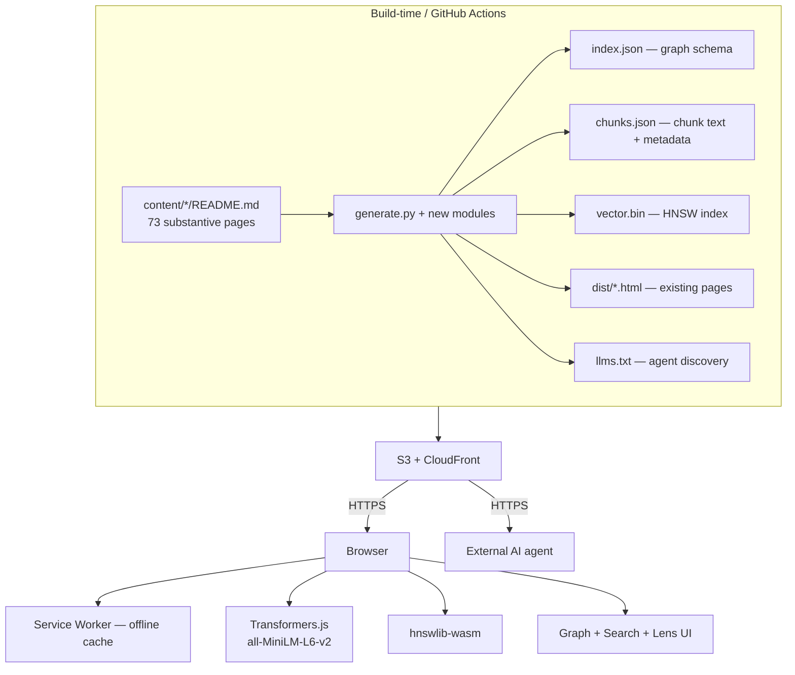

# Knowledge Graph v1.1 — Implementation Specification

**Status:** Draft, pending architectural sign-off
**Author:** Drafted by AI assistant, chiseled from the v1.0 brain-dump
**Project:** `ascendion.engineering` knowledge library
**Targets:** v42 production codebase (`tools/generate.py`, 18 sections, 73 substantive pages)

---

## 1 — Purpose

The v42 knowledge graph is a force-directed visualization of the library: 73 substantive pages, 224 standards, 547 edges. Users can drag, zoom, hover for a one-line description, and click to navigate. The core failure: clicking ends the graph session. The graph is a launchpad, not a workspace.

v1.1 turns the graph into the primary navigation and reasoning surface of the library, addressable by both humans and AI agents. The design decisions are constrained by three immovable requirements:

1. **Zero ongoing cost.** S3 storage and CloudFront egress only; no Bedrock, no Lambda compute, no managed vector DB.
2. **Offline-capable.** After first visit, the system functions without network — including semantic search.
3. **Honest provenance.** External knowledge is referenced and cited, never republished. Authored content remains the only first-class corpus.

These constraints push the architecture toward a single shape: build-time intelligence, browser-side execution, no server in the loop.

## 2 — Non-goals (the explicit chisel)

The v1.0 brain-dump contained ideas that v1.1 explicitly does not pursue. Recording them here so the reasoning trail is preserved and so future contributors don't reinvent the same conversation.

| Brain-dump idea | Status in v1.1 | Reason |
|---|---|---|
| Bedrock LLM at synthesis time | Deferred to v1.2 | Per-token cost; conflicts with zero-ongoing-cost constraint. |
| WebLLM / on-device Llama / Phi-3 | Deferred to v1.3 | 4–5GB first-load; WebGPU dependency excludes some FSI client environments; output quality lower than authored library content. |
| Scraping Netflix/Uber/Stripe/AWS blogs | Out of scope | Copyright. Conversion to Markdown via Firecrawl/Crawl4AI does not grant redistribution license. |
| Stack Overflow ingestion | Out of scope | CC BY-SA 5.0 share-alike viral clause; would constrain the licensing posture of derivative portal content. |
| ISO/IEEE standards republished as text | Out of scope | Not free to redistribute. NIST publications are public domain and remain link-targets only. |
| TOON as primary storage format | Deferred | Token-density value applies only when feeding structured data into LLM context. With no LLM in v1.1, gzip-on-JSON wins on every dimension. TOON optionally re-enters as a render-time transform if/when v1.2 lights up. |
| 29-topic ontology in the brain-dump | Out of scope | Overlaps and duplicates the existing 18-section taxonomy. Adopting it means re-architecting the library. |
| Authority scoring of external sources (e.g., K8s ADR = 1.0, obscure project = 0.3) | Out of scope | Arbitrary numeric weights silently bias retrieval. v1.1 surfaces provenance instead and lets the user judge. |
| Empty-state poetry / "Engineering Cockpit" framing | Out of scope | Conflicts with the established library voice (substantive architectural tone, not marketing). |

## 3 — Architecture overview



The pattern is **build-once, run-everywhere-locally**. CI does the heavy lifting; the user's browser does retrieval; nothing in between. An AI agent fetches the agent endpoint directly without running the embedding stack.

## 4 — Data model

### 4.1 Existing schema (preserved from v42)

```ts
type NodeKind = "page" | "standard"
type EdgeKind = "alignment" | "related"

interface Node {
  id: string            // "section/subsection" or "tag:<slug>"
  label: string
  type: NodeKind
  url: string
  description: string
  section?: string      // page nodes only
}

interface Edge {
  source: string
  target: string
  kind: EdgeKind
}
```

### 4.2 New additions

**Lens membership** is annotated on page nodes. A lens is an authored cross-cutting pattern.

```ts
interface PageNode extends Node {
  type: "page"
  lenses: string[]      // lens IDs this page belongs to
}

interface Lens {
  id: string                // "debt-ledger"
  label: string             // "Debt Ledger"
  description: string       // 1-3 sentence explanation
  member_pages: string[]    // page IDs
  caption?: string          // optional pull-quote from the canonical page
}
```

**Chunks** are sub-page units that semantic search operates over. Each chunk has a stable ID and a kind.

```ts
type ChunkType = "caption" | "principle" | "pitfalls" | "checklist" | "references"

interface ChunksFile {
  schema_version: "1.0"     // present at top level; additive metadata
                            // fields (e.g. build_date, embedding_model)
                            // can be added without bumping
  chunks: Chunk[]           // sorted by id for byte-determinism
}

interface Chunk {
  id: string                // "<page_id>:<chunk_type>" or
                            // "<page_id>:principle:<n>" (n is 0-based)
  page_id: string
  chunk_type: ChunkType
  chunk_index: number       // 0-based ordinal within the page
  text: string              // raw text
  text_length: number       // len(text), precomputed for consumers
  references: string[]      // gold-reference IDs cited in this chunk
}
```

**Gold references** replace the flat `TAG_LINKS` dict.

```ts
interface GoldReference {
  id: string                // "nist-800-53-r5"
  label: string             // human-readable
  url: string
  organization: string      // "NIST", "W3C", "CNCF", "ISO" (link only), "IEEE" (link only)
  license: string           // "public-domain" | "cc-by-4.0" | "link-only" | …
  last_verified: string     // ISO date
  summary: string           // 1-3 sentences, Jeril-authored
  summary_author: string    // attribution within the team
  summary_date: string      // when the summary was written
}
```

### 4.3 File outputs (under `dist/knowledge-graph/agent/v1/`)

| File | Purpose | Approx size at v1.1 |
|---|---|---|
| `index.json` | Graph: nodes + edges + lenses. No chunk text, no embeddings. The minimal contract for agents that want structure without bulk. | ~200 KB |
| `chunks.json` | JSON object `{schema_version: "1.0", chunks: [...]}`. Chunk metadata + text, sorted by id. `schema_version` allows additive metadata (build_date, embedding_model) without breaking v1.0 consumers. Paired with `vector.bin` by chunk-list index. | ~600 KB |
| `vector.bin` | HNSW binary index, 384-dim, ~730 chunks. | ~500 KB |
| `gold_references.json` | Gold reference registry. | ~80 KB |
| `schema.json` | JSON Schema describing `index.json`. The machine-readable contract. | ~10 KB |

Plus, at site root: `dist/llms.txt` — an `llms.txt`-convention discovery file pointing at the agent endpoints.

All files are content-hashed in their URL paths (`/agent/v1/index-<hash>.json`) so cache invalidation is automatic when content changes.

## 5 — Build pipeline additions

### 5.1 `tools/generate.py` changes

Concrete additions; existing functions preserved unless noted.

| New function | Responsibility |
|---|---|
| `chunk_page(metadata_entry, readme_text) -> List[Chunk]` | Parses the README structure (1-line caption, 6 numbered principles, ⚠️ pitfalls block, ☐ checklist, References list) and emits typed chunks. Reuses existing parsing primitives. |
| `build_chunk_corpus(metadata) -> List[Chunk]` | Walks all substantive pages; calls `chunk_page` per page; assigns chunk IDs. |
| `compute_lens_data(metadata) -> List[Lens]` | Reads `CONCEPT_LENSES` from `seed_content.py`; resolves member page IDs; emits Lens records. |
| `build_gold_reference_registry() -> List[GoldReference]` | Reads `GOLD_REFERENCES` (new, replaces `TAG_LINKS`) from `generate.py`; emits structured records. |
| `gen_agent_endpoint(graph_data, lenses, refs, out_root)` | Writes `index.json`, `gold_references.json`, `schema.json` under `dist/knowledge-graph/agent/v1/`. |
| `gen_llms_txt(out_root)` | Writes `dist/llms.txt`. |

| Modified function | Change |
|---|---|
| `compute_graph_data(metadata)` | Annotates each page node with `lenses: List[str]`. |
| `gen_knowledge_graph_page(graph_data, out_root)` | Replaces v42 standalone D3 render with the v1.1 UX described in §7. Loads `chunks.json` and `vector.bin` lazily; embedding model is loaded on first user query. |

### 5.2 New CI step (`.github/workflows/deploy.yml`)

A new job runs after `seed_content.py` and `generate.py`, before the S3 sync:

```yaml
- name: Build vector index
  run: |
    pip install sentence-transformers==2.7.0 hnswlib==0.8.0 numpy
    python tools/build_vector_index.py \
      --chunks dist/knowledge-graph/agent/v1/chunks.json \
      --out dist/knowledge-graph/agent/v1/vector.bin
```

`tools/build_vector_index.py` is a new file:

```python
# Skeleton — exact implementation deferred to alignment sign-off.
import json, hnswlib, numpy as np
from sentence_transformers import SentenceTransformer

model = SentenceTransformer("sentence-transformers/all-MiniLM-L6-v2")
chunks = json.loads(open(args.chunks).read())
embeddings = model.encode([c["text"] for c in chunks], normalize_embeddings=True)

p = hnswlib.Index(space="cosine", dim=384)
p.init_index(max_elements=len(chunks), ef_construction=200, M=16)
p.add_items(embeddings, np.arange(len(embeddings)))
p.save_index(args.out)
```

### 5.3 New `seed_content.py` addition

```python
CONCEPT_LENSES = {
    "debt-ledger": {
        "label": "Debt Ledger",
        "description": (
            "Eight pages share the same architectural shape: every well-run "
            "NFR or compliance domain produces a debt-ledger artefact whose "
            "movement is architectural signal — not a defect to suppress."
        ),
        "members": [
            "nfr/maintainability",
            "nfr/security",
            "nfr/reliability",
            "nfr/usability",
            "compliance/bsp-afasa",
            "compliance/gdpr",
            "compliance/iso27001",
            "compliance/pci-dss",
        ],
        "caption_source": "nfr/usability",  # the page where the cross-cutting claim is authored
    },
    # Future lenses: NFR-domain, compliance-regime, observability-triad, etc.
    # Each costs ~5 lines.
}
```

### 5.4 Build artifact size budget

Target: total `dist/knowledge-graph/agent/v1/` payload **under 2 MB** at v1.1 scale (73 pages, ~730 chunks). At 200 pages (projected v50 scale) the payload is still under 6 MB. CloudFront serves these gzipped; over-the-wire is roughly 30–40% of disk size.

## 6 — Frontend stack

The v42 stack is static HTML + vanilla JS + D3. v1.1 keeps that posture — no React, no Next.js, no build step on the frontend. The library's voice is consistent with this, and onboarding new contributors stays trivial.

New dependencies, all served from a CDN with SRI hashes:

| Library | Purpose | Approx size |
|---|---|---|
| `@xenova/transformers` | Run all-MiniLM-L6-v2 in the browser | ~150 KB JS + ~22 MB model (lazy-loaded on first query) |
| `hnswlib-wasm` | Vector kNN | ~50 KB wasm + ~500 KB index |
| Service Worker (vanilla) | Offline cache | own code, no dependency |

D3 v7 stays. No new graph-rendering library.

**First-load tax:** ~25 MB the first time a user opens `/knowledge-graph/`. After that, everything is Service-Worker-cached and instant. The model and wasm are content-hashed at well-known URLs and cached with `immutable` headers.

**Lazy loading:** the embedding model is not fetched until the user types into the search box. The graph view itself loads with only `index.json` (~200 KB).

## 7 — UX specification

### 7.1 Layout

```
+--------------------------------------------------------------+
| Nav (existing)                                               |
+--------------------------------------------------------------+
| [Search bar — semantic]              [Lens: All ▾]           |
+----------------------------------------+---------------------+
|                                        |                     |
|                                        |   Side panel        |
|        Graph canvas (D3)               |                     |
|                                        |   (page details)    |
|                                        |                     |
|                                        |                     |
+----------------------------------------+---------------------+
| Legend  ·  hint                                              |
+--------------------------------------------------------------+
```

On mobile, side panel becomes a bottom drawer.

### 7.2 Click behavior — the central change

Clicking a page node **opens the side panel; it does not navigate.** Panel contents:

1. Title and section breadcrumb
2. Description (full first paragraph from the README, not truncated)
3. **Top-N semantically nearest pages** computed at render-time from `vector.bin` against the page's caption chunk
4. Alignment tags as chips, each linking to the gold reference panel for that tag
5. Concept-lens membership badges
6. Gold references for tags this page aligns with — title, organization, summary, "Open source ↗"
7. Explicit "Open page →" button (full-width, primary-color)

Standards nodes open a smaller panel showing the gold reference. External link opens in a new tab as today.

### 7.3 Search — semantic, highlight-and-dim

User types in the search bar. After ~300ms of stillness:

1. Query text → all-MiniLM-L6-v2 → 384-dim vector (in-browser, ~50ms after first warmup)
2. hnswlib `searchKnn(queryVec, k=20)` → 20 most relevant chunks
3. Pages owning those chunks are highlighted (full opacity); other pages dim to ~10%
4. Side panel shows ranked chunk snippets with their parent page titles
5. Clicking a snippet opens the page panel scrolled to that section

Search is purely client-side. No network call. No telemetry. No external service.

### 7.4 Lens selector

Top-bar dropdown: `All / Debt Ledger / …` (future lenses register here automatically).

When a lens is selected:
- Member pages keep full opacity
- All other nodes dim to ~10%
- Edges between member pages are drawn thicker
- The lens caption appears as a banner above the graph

### 7.5 Standards demoted to halo

Standards (224 nodes today) currently render as full-size nodes equal to pages, drowning the page network. v1.1 changes:
- Radius halved
- Opacity 0.4
- Labels hidden until hovered
- Excluded from default search results unless `kind:standard` is in the query

This is the v43 visual-hierarchy fix carried into v1.1.

### 7.6 Adjacent suggestions — supporting intuitive pattern recognition

For any opened page, the side panel surfaces three categories of neighbors:

1. **Curated neighbors** (existing `related` edges, author-declared)
2. **Lens siblings** (other pages in the same concept lens)
3. **Adjacent suggestions** — semantic neighbors *not* connected by a curated edge or shared lens. These are surfaced as "You might also see…" with a brief explanation: *"This page shares vocabulary with [neighbor], but is not explicitly linked. Worth checking if the connection is real."*

The third category is the load-bearing affordance for the Hawking/Einstein note in your prompt. Pattern recognition often happens at the boundary of structure — between things explicitly linked and things merely adjacent. The graph should make that boundary visible without collapsing it.

### 7.7 Empty state

> Search the library or click a node to begin.

No marketing voice. Matches `AUTHORING_CONVENTIONS`.

### 7.8 Mobile

Side panel becomes a swipe-up drawer. Graph canvas takes full width. Search and lens selector remain pinned at the top. Force-simulation layout is **precomputed at build time** for mobile (with a deterministic seed) and shipped as static x/y coordinates, eliminating the 300-ms simulation jank on low-end devices. Desktop continues to run live simulation for the drag-and-rearrange affordance.

## 8 — AI-agent interface

### 8.1 The contract

`/knowledge-graph/agent/v1/index.json` is the canonical machine-readable representation of the library. Schema is documented in `schema.json` at the same path. URL is **versioned** — a future `v2` schema does not break agents pinned to `v1`.

### 8.2 Discovery via `llms.txt`

Site root: `dist/llms.txt`:

```
# ascendion.engineering — knowledge library

This site exposes a structured knowledge graph at:
  https://ascendion.engineering/knowledge-graph/agent/v1/index.json

Schema:
  https://ascendion.engineering/knowledge-graph/agent/v1/schema.json

Chunked content (paired with vector.bin):
  https://ascendion.engineering/knowledge-graph/agent/v1/chunks.json

Gold reference registry:
  https://ascendion.engineering/knowledge-graph/agent/v1/gold_references.json

License: see https://ascendion.engineering/about/ for content licensing.
External standards are linked, not republished.
```

### 8.3 What an agent gets

- The full graph (nodes, edges, lenses) without running JavaScript
- All chunk texts with stable IDs (an agent can build its own embedding store if it doesn't trust ours)
- Gold references with provenance metadata
- A schema document so the contract is auditable

### 8.4 What an agent does NOT get

- Embeddings are intentionally not in `index.json` — they bloat the file and are reproducible from chunk text. Agents that want embeddings download `vector.bin` separately.
- No write endpoint. The portal is read-only over HTTP.
- No authentication. v1.1 publishes the agent endpoint publicly under the same license as the rest of the site.

### 8.5 Optional TOON variant — explicitly deferred

If a future v1.2 introduces LLM synthesis, the agent endpoint can emit a TOON variant alongside JSON: `index.toon`, `chunks.toon`. Generation is a build-time transform; storage and discovery treat it as a secondary format. Adopting TOON before there is an LLM in the loop adds complexity without payoff.

## 9 — Corpus strategy

Three principles, in priority order:

### 9.1 Internal-first

The 73 substantive pages of the library are the corpus. They are hand-authored, follow `AUTHORING_CONVENTIONS`, are voiced for a global engineering audience, and represent your architectural position. v1.1's intelligence is *of* this corpus, not *over* a scraped one.

### 9.2 Gold reference is a registry, not a corpus

External canonical sources (NIST publications, W3C/IETF specs, CNCF project docs, vendor architecture-frameworks) are referenced, never republished. For each:

- The URL is preserved
- A short Jeril-authored summary (1–3 sentences) explains why this reference is canonical for this concept
- Provenance metadata (organization, license, last_verified) is surfaced to the user
- Re-verification of HTTPS reachability runs in CI quarterly via the existing link-verifier

This pattern gives users (and agents) one click from a library concept to its canonical external statement, with provenance. It does not put the portal in the redistribution business.

### 9.3 Future-extensibility

The brain-dump's "scrape Netflix/Stripe/Uber" idea is preserved as a v2.0 path under explicit licensing constraints — e.g., per-user API keys for live fetch with no S3 republication, or formal content-license agreements with specific publishers. v1.1 deliberately leaves that path open by structuring the gold-reference registry with a `license` field today.

## 10 — UX support for intuitive pattern recognition (the Einstein/Hawking note)

Stated substantively, in the library voice. Three architectural mechanisms in v1.1 support pattern recognition over linear retrieval:

**Concept lenses make authored cross-cutting patterns first-class.** The debt-ledger pattern is asserted in the library (`nfr/usability/README.md` writes the meta-claim explicitly). The graph not surfacing it was a missed pedagogical move; v1.1 corrects that. Future lenses encode patterns as they're recognized — the mechanism is generic, the cost per lens is ~5 lines of `seed_content.py`.

**Adjacent suggestions surface unintended-but-real connections.** Two pages may share vocabulary without sharing an authored link. Often the connection is real — and noticing it is a cognitive move that structured retrieval suppresses. v1.1 surfaces these as a bounded category clearly labeled as inference, not as ground truth.

**Multi-hop traversal preserves the user's place.** Today, clicking a node ends the graph session; the user has to navigate back. v1.1's side-panel model lets a user walk a thread — page → semantic neighbor → lens sibling → adjacent suggestion — without leaving the graph. This is the workspace shift, and it's the mechanic that lets pattern recognition build over the course of a session.

## 11 — Deferred features (explicit triggers for promotion)

| Feature | Trigger condition | Likely cost |
|---|---|---|
| Cloud LLM synthesis (Bedrock proxy) | Search-only proves insufficient for "compare X vs Y" / "find pattern for Z compliant with W" use cases. Measured by user feedback or query analytics. | Per-token, ~$0.003 per query, unbounded by user volume. |
| On-device LLM (Phi-3-mini or smaller via WebLLM) | WebGPU support reaches FSI client baseline AND v1.2 cloud cost grows meaningful. | First-load tax 1–2 GB; ongoing zero. |
| External corpus integration | Gold-reference curation hits a maintenance ceiling AND a clean licensing pattern emerges. | Depends on licensing model. |
| Career-path concept lenses | Engineers ask for guided reading sequences (e.g., "for a new SA, read these 12 pages in order"). | Authoring cost only — no architecture change. |
| TOON variant of agent endpoint | v1.2 LLM synthesis lands and prompt-token cost becomes a binding constraint. | Build-time transform only. |
| PR-reviewable graph diff | Curated edges are lifted into a structured authored file (separate v44+ refactor). | Authoring tooling cost. |

## 12 — Implementation plan (phased)

Ordered by dependency, not by urgency. Each phase is independently shippable; the graph remains functional throughout.

| Phase | Scope | Output |
|---|---|---|
| **A — Build pipeline** | `chunk_page`, `build_chunk_corpus`, `build_vector_index.py`, CI step. | `chunks.json` + `vector.bin` published to S3. |
| **B — Agent endpoint** | `gen_agent_endpoint`, `schema.json`, `llms.txt`. | `/agent/v1/*` reachable; agents can fetch graph. |
| **C — Visual hierarchy fix** | Standards demoted in `gen_knowledge_graph_page`. | v43 fix carried into v1.1. |
| **D — Side panel UX** | Right-side panel replaces hard-navigation; click opens panel. | Graph is now a workspace. |
| **E — Concept-lens mechanism** | `CONCEPT_LENSES` in `seed_content.py`; lens annotation on nodes; lens selector in UI. | Debt-ledger ships as first instance. |
| **F — Gold-reference registry** | `GOLD_REFERENCES` replaces `TAG_LINKS`; registry surfaced in side panel. | Tags upgraded with provenance. |
| **G — Semantic search** | Transformers.js + hnswlib-wasm wired up; search bar; highlight-and-dim. | Browser-side semantic search live. |
| **H — Adjacent suggestions** | Top-N semantic neighbors per page in side panel. | Pattern-recognition affordance live. |
| **I — Service Worker** | Offline cache for HTML, agent JSON, model, wasm. | Library works without network after first visit. |
| **J — Mobile precomputed layout** | Build-time force simulation with deterministic seed; coordinates shipped. | Mobile graph is jank-free. |

Each phase ends with verified outputs in `dist/`, an HTTPS link-verifier pass, and an updated stage script (`stage_v43.sh`, `stage_v44.sh`, etc., per existing convention).

## 13 — Open questions for sign-off

These calls are not made in this spec; they need explicit sign-off before implementation.

1. **Embedding model:** confirm `all-MiniLM-L6-v2` (384-dim, ~22 MB quantized, well-supported in Transformers.js). Alternative: `bge-small-en-v1.5` (384-dim, slightly higher quality on technical text per the BGE benchmark, ~33 MB). The size difference is meaningful for first-load tax on mobile.
2. **Chunking granularity:** the spec proposes ~10 chunks per page (caption + 6 principles + pitfalls + checklist + references). Is the references chunk worth indexing, or is it noise?
3. **Section-index pages as graph nodes:** open from the v43 conversation. The 172 vs 73 discrepancy still applies. Recommend including section-index pages as a third node type (`section`), styled lighter than pages but heavier than standards. Confirm or override.
4. **Gold-reference summaries:** who authors them? `summary_author` defaults to your name; if the team writes them, the field tracks ownership for review. Confirm the authoring model.
5. **Adjacent-suggestions count and threshold:** propose top-3 neighbors with cosine similarity > 0.55. Below 0.55, the suggestion is suppressed (not all pages have meaningful semantic neighbors). Numbers tunable after a first build.
6. **HNSW parameters:** propose `M=16, ef_construction=200, ef_search=50`. These are sensible defaults at this scale; performance characterization happens after first build.

## 14 — Acceptance criteria

v1.1 ships when:

- [ ] `dist/knowledge-graph/agent/v1/{index,chunks,gold_references,schema}.json` and `vector.bin` are generated by CI on every push to `main` and verified to be schema-valid.
- [ ] `dist/llms.txt` is generated and points at the agent endpoints.
- [ ] Clicking a page node in the graph opens the side panel; the page does not navigate away unless the user clicks "Open page →".
- [ ] Typing in the search bar produces semantic results within 500 ms of stop-typing on a representative dev laptop.
- [ ] Selecting the Debt Ledger lens highlights exactly the eight authored member pages.
- [ ] Standards render as a low-opacity halo, not as full-equivalent nodes to pages.
- [ ] After a first visit, the entire `/knowledge-graph/` route loads and functions with the network disabled in DevTools.
- [ ] An external `curl` of the agent endpoint returns valid JSON parseable against `schema.json`.
- [ ] Total `/knowledge-graph/agent/v1/` payload is under 2 MB.
- [ ] No external blog content is republished; gold-reference registry contains only links and Jeril-authored summaries.

---

*End of v1.1 specification. Implementation phases A–J are gated on alignment sign-off on the open questions in §13.*
